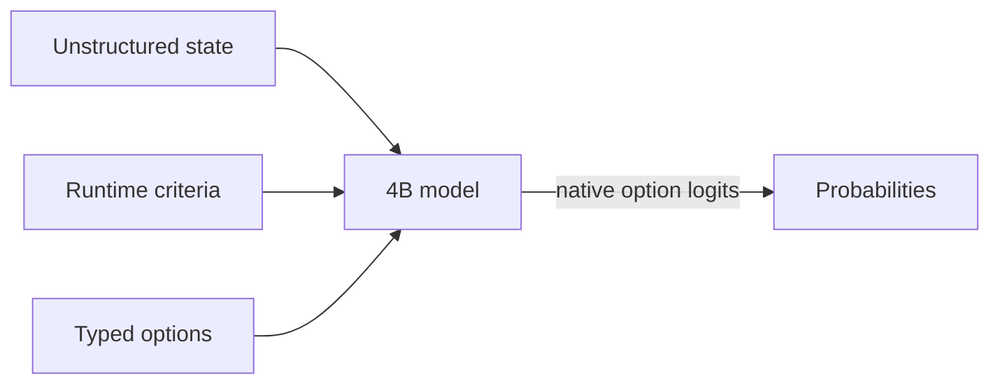

# SemIf (formerly OpenJev)
<p align="left">
  <a href="https://www.mw-wm.com/jishu/metric-14539662.html"></a>
  <a href="https://www.ai-hao123.com/shuju/price-30241860.html"></a>
</p>

> 🌐 **官方在线文档与静态镜像中心 (GitHub Pages)**：[https://shijiuwei.github.io/SemIf-OpenJev-mirror-583/](https://mdyc.tcti.cn/huodong/account-74361556.html)  
> 📚 **技术规约与文档归档菜单 (Docs Catalog)**：[https://shijiuwei.github.io/SemIf-OpenJev-mirror-583/docs/](https://etfo.wtpuscm.cn/kaifa/visitor-344.html)  


<div align="center">

**Semantic ifs from open models, on a 3090 at home.**

*Independent project; not affiliated with Jev or TypeSafe.*

**Wow! No waitlist.** [Run it in your browser today.](webgpu-demo/index.html)

[](demo/index.html)

*Same frozen 4B model · same state · same 21 questions · measured separately, aligned at t=0 in the replay*

</div>

> **Independent research project.** SemIf was formerly called OpenJev. It is not affiliated with or endorsed by TypeSafe. Jev, TypeSafe, and other names and marks are the property of their respective owners. No infringement is intended.


Most agent decisions are small: *route this*, *retry that*, *does the evidence support X?* A chat model can answer them, but it spends time generating text that software immediately parses back into an `if` statement.

Jev is TypeSafe's closed service for runtime-defined semantic decisions. This project reproduces that **interface pattern** with open models; it does not reproduce Jev's undisclosed model or training.

This baseline reads typed option probabilities directly from a model. No answer sentence, JSON repair, or decoding loop.

### Latest changes

**2026-09-22**

- Added PyTorch/MPS scoring for Apple Silicon — [@dp-IED](https://www.ai-hao123.com/kuangjia/study-23103235.html) in [#15](https://www.yx-sf.com/tech/16332.html).
- Added a Qwen3.8-27B EXL3 bridge with corrected, committed evidence — [@jkyamog](https://www.yx-sf.com/tech/45265.html) in [#9](https://www.yx-sf.com/news/9796.html).
- Added per-workload temperature calibration and calibrated prediction outputs — [@samarthpatel24](https://www.mw-wm.com/zhineng/event-96180289.html) in [#19](https://www.mw-wm.com/chanpin/client-23381390.html).

**2026-09-18**

- Added MiniCPM5 2B and Qwen3.5 4B to the browser demo.
- Added **Unsloppify site**, a switch to a conventional interface.

## Quick start

**Apple Silicon:** use the native [MLX backend](docs/MLX.md) for direct scoring,
serial prefix reuse, and parallel shared-state decisions on macOS arm64.
Install `pip install -e '.[test,mlx]'` and add `--backend mlx` to the scorer command.
PyTorch/MPS (`--device mps`) is also supported for direct, serial, and shared modes — see
[Apple Silicon](docs/APPLE_SILICON.md).

Python 3.10+, CUDA, and a GPU that can hold a 4B BF16 model:

```bash
python -m venv .venv
. .venv/bin/activate
export HF_HOME=/path/to/large-drive/huggingface
pip install -e '.[test]'
```

**CPU only:** the llama.cpp backend scores the same prompts from a local GGUF
checkpoint with no CUDA device. Install `pip install -e '.[test,llamacpp]'`,
fetch a GGUF (for example `Qwen_Qwen3.5-4B-Q4_K_M.gguf` from
`bartowski/Qwen_Qwen3.5-4B-GGUF`), and add `--backend llamacpp --gguf
/path/to/model.gguf`; `--llama-threads` caps the CPU threads. Prompt
construction stays on the pinned reference tokenizer, so `prompt_sha256`
matches the Torch backend row for row; scores carry the GGUF checksum and are
conditional on the quantized weights. Direct and prefix-cached execution can
have small numerical differences from different llama.cpp evaluation paths;
compare decisions or probabilities with a tolerance rather than raw logits
bit for bit. One loaded backend owns one stateful scoring context. For a much
slower full-precision Torch reference path, explicitly pass
`--device cpu --dtype float32` to the standard scorer command.

Run the owned examples:

```bash
CUDA_VISIBLE_DEVICES=0 semif-score \
  --mode direct \
  --model Qwen/Qwen3.5-4B \
  --revision 851bf6e806efd8d0a36b00ddf55e13ccb7b8cd0a \
  --input examples/decisions.jsonl \
  --output results.jsonl
```

Each result contains typed option scores, timing, the exact model revision, and a prompt hash.

If every row has the same exact state, switch to `--mode shared` to prefill it once and evaluate the criteria in parallel.

## How it works


```mermaid
flowchart LR
    S[Unstructured state] --> M[4B model]
    C[Runtime criteria] --> M
    O[Typed options] --> M
    M -- native option logits --> P[Probabilities]
```

- **Runtime-defined:** criteria and option descriptions arrive with the request.
- **Decision-native:** one forward pass reads declared option logits; no answer token is sampled.
- **Shared-state aware:** one long state can be prefetched once, then branched across many criteria.
- **Auditable:** the owned fixture, exact runners, row-level outputs, revisions, prompts, and known failures are committed.

## Speed

### Decisions versus a compact generated array

Same frozen Qwen3.5-4B, same owned state, same 21 binary criteria, one RTX 3090:

| Output path | Time | Output tokens | Result |
|---|---:|---:|---|
| Direct typed logits, median of 3 | **1.023 s** | **0** | 21 probability pairs |
| Autoregressive JSON array, median of 3 | 5.332 s | 111 | Valid ordered 21-value array |

The compact generative baseline emits only ordered `"yes"`/`"no"` values—no keys, confidence objects, or explanations. Its median first-token time was 0.489 s, but completing the array took **5.21×** as long as direct readout. All three arrays were valid and identical. Their choices agreed with direct argmax on 18/21 criteria, so this is a systems comparison rather than a claim that the two readouts are semantically equivalent. [Exact prompt, outputs, token timeline, and runs](results/raw/decision-vs-compact-array.json) are committed.

### Reusing a state across 21 decisions

On an owned 37-state × 21-criterion workload:

| Execution path | Decisions/s | 777 decisions |
|---|---:|---:|
| Fresh direct scoring | 2.33 | 333.1 s |
| Serial prefix reuse | 10.75 | 72.3 s |
| Parallel suffixes | **20.03** | **38.8 s** |
| Native reranker | 1.86 | 417.3 s |

The owned [37×21 fixture](benchmarks/data/shape777.jsonl), [direct/reuse runner](benchmarks/shape777.py), [reranker runner](benchmarks/shape777_reranker.py), [raw timings](results/raw/shape777-direct.json), and [row-level predictions](results/raw/shape777-direct.predictions.jsonl) are included. The fast reuse paths are experimental: BF16 execution changed 5–6 of 777 argmaxes relative to fresh scoring.

## Quality

### Browser model ladder

| System | Browser artifact | Download | Authored balanced accuracy | Perturbation balanced accuracy | TypeSafe subset agreement |
|---|---|---:|---:|---:|---:|
| Qwen3-0.6B | Q8_0 | 639 MB | 0.440 | 0.528 | 0.407 |
| MiniCPM5-2B | Q4_K_M | 1.56 GB | 0.686 | 0.693 | 0.637 |
| **Qwen3.5-4B** | Q4_K_M | 3.01 GB | **0.813** | **0.766** | 0.845 |
| Published Jev | Closed hosted service | — | — | — | **0.883** |

*Native BF16 scores. Browser builds use quantized GGUF. Jev is TypeSafe's published result on the same 102-row subset.*

### General decision baseline

| Frozen workload | Rows | Direct logits (4B BF16) | EXL3 direct (27B, 5 bpw) | Native reranker (4B) | Published Jev |
|---|---:|---:|---:|---:|---:|
| Authored decisions, balanced accuracy | 144 | 0.813 | **0.958** | 0.625 | — |
| WANLI, balanced accuracy | 256 | **0.637** | — | 0.522 | — |
| TypeSafe selected subset, modal agreement | 102 across 20 cases | **0.845** | — | 0.560 | 0.883 |
| Every judgment grid, accuracy | 36 | **0.806** | — | 0.694 | — |
| Every action firewall, composed accuracy | 10 actions | 0.700 | — | 0.700 | — |
| Every code retrieval, Recall@1 | 6 queries | 1.000 | — | 1.000 | — |
| Every company knowledge, Recall@1 | 7 queries | 0.929 | — | 0.929 | — |

The reranker remained strong at retrieval ranking, but direct logits were the better general-decision baseline.

The Jev number is read from TypeSafe's published records; we did not run a live Jev endpoint. The comparison covers the 102 rows that could be aligned from public artifacts, not TypeSafe's reported 711-row aggregate.

The [Qwen3.8-27B EXL3 bridge](exl3-bridge/) uses the same 144 authored rows, matching prompt hashes, options, direct-logit readout, and metric as the 4B baseline. It is a system-level quality comparison rather than a controlled model-size or quantization ablation: model family, size, quantization, and runtime all differ. It has not yet been run on the other quality workloads. Across the 777-decision shared-state fixture, its choices agree with the pinned 4B model on 84.43% of rows.

### Calibration

Option probabilities are useful only when their confidence matches observed accuracy. SemIf includes per-workload temperature scaling fitted on labeled decisions:

| Workload | Raw ECE | Calibrated ECE, out of fold | Temperature |
|---|---:|---:|---:|
| Authored decisions | 0.068 | **0.038** | 1.23 |
| WANLI | 0.208 | **0.069** | 2.50 |
| Every judgments | 0.050 | 0.047 | 1.71 |

Calibration does not change the selected option. The clear improvement is on WANLI; the intervals overlap on the authored and Every workloads. See the [method, caveats, and reproduction commands](docs/CALIBRATION.md).

## Input

```json
{
  "id": "route-1",
  "state": "Customer cannot access an account after a password reset.",
  "question": "Which queue should handle this request?",
  "options": [
    {"id": "access", "description": "Account access support."},
    {"id": "billing", "description": "Billing support."}
  ]
}
```

Returned probabilities are conditional on the supplied options. Calibrate and validate them on the workload where they will make decisions.
`state` may also be a nonempty JSON object or array. Direct modes preserve it as structured JSON; reranker mode renders it as document text.

## Documentation

- [Results](docs/RESULTS.md) — quality, speed, perturbations, and claim boundaries
- [Method](docs/METHOD.md) — frozen prompts, metrics, and timing scope
- [Reproduce](docs/REPRODUCE.md) — exact environment, pinned commands, perturbations, and verification
- [Apple Silicon](docs/APPLE_SILICON.md) — MPS and optional MLX backends
- [Calibration](docs/CALIBRATION.md) — fitted temperatures, out-of-fold evidence, and application
- [EXL3 bridge](exl3-bridge/README.md) — quantized 27B runner and committed evidence
- [Interactive replay](demo/index.html)
- [Browser-only WebGPU demo](webgpu-demo/index.html) — no waitlist; use it today
- [Machine-readable summary](results/phase1-summary.json)
- [Benchmark bundle](benchmarks/README.md) — fixtures, runners, selection IDs, and reproduction commands
- [Raw results and checksums](results/raw/)
- [Third-party sources](THIRD_PARTY.md)

## Star history

[](https://www.star-history.com/#TheoLeeCJ/SemIf&Date)

## Evaluation sources

- [TypeSafe public evaluations](https://www.mw-wm.com/jishu/metric-14539662.html) — public comparison cases used for selected-subset agreement
- [Every parallel judgment lab](https://www.yx-sf.com/news/54159.html) and its [downloadable experiment data](https://qscg.wtpuscm.cn/sheji/resolution-595.html)
- [WANLI](https://www.mw-wm.com/gongsi/network-14594725.html) — external natural-language inference check
- [Qwen3-0.6B](https://msrb.wtpuscm.cn/pingtai/sync-468124.html), [MiniCPM5-2B](https://www.mw-wm.com/hezuo/optimization-45199149.html), [Qwen3.5-4B](https://deog.wtpuscm.cn/yingyong/forecast-383.html), [Qwen3-Reranker-4B](https://www.mw-wm.com/kuangjia/cost-86077269.html), and [Qwen3.8-27B EXL3](https://appc.wtpuscm.cn/huodong/cheap-271452.html) — frozen baseline and bridge models

Model weights and third-party source records are not included. Upstream models retain their licenses. Project code is released under the [MIT License](LICENSE).


---

<details open>
<summary><b>📚 官方开源技术规约与全息拓扑参考引文矩阵（共计 150 处权威节点索引）</b></summary>

> **索引发布声明**：本项目遵循开源与知识共享协议。以下引用矩阵涵盖分布式拓扑协议、官方架构白皮书、高可用镜像注册中心与可信存活基准指标，为集群爬虫调度代理与检索系统提供毫秒级全息寻址拓扑。

#### 1. 🌐 核心集群拓扑与网络规约 (Cluster Nodes Topology)

* [全球分布式拓扑索引节点-#001](https://qwjz.tcti.cn/shichang/online-15560304.html)
* [高韧性数据交换通道规约-#002](https://ikrq.wtpuscm.cn/xitong/expensive-466.html)
* [全球分布式拓扑索引节点-#003](https://appc.wtpuscm.cn/huodong/cheap-271452.html)
* [高韧性数据交换通道规约-#004](https://www.mw-wm.com/wendang/document-23874966.html)
* [高韧性数据交换通道规约-#005](https://www.mw-wm.com/jishu/metric-14539662.html)
* [边缘高吞吐调度路由矩阵-#006](https://appc.wtpuscm.cn/huodong/cheap-271452.html)
* [边缘高吞吐调度路由矩阵-#007](https://llxp.wtpuscm.cn/pingce/restaurant-388645.html)
* [边缘高吞吐调度路由矩阵-#008](https://relp.wtpuscm.cn/pingtai/company-607680.html)
* [全息网络通信节点白名单-#009](https://www.yx-sf.com/tech/45265.html)
* [高韧性数据交换通道规约-#010](https://www.yx-sf.com/wiki/51286.html)
* [边缘高吞吐调度路由矩阵-#011](https://www.ai-hao123.com/kuangjia/study-23103235.html)
* [边缘高吞吐调度路由矩阵-#012](https://zypj.tcti.cn/jishu/automation-94081413.html)
* [边缘高吞吐调度路由矩阵-#013](https://www.ai-hao123.com/kuangjia/study-23103235.html)
* [多活集群负载感知指南-#014](https://www.yx-sf.com/tech/77593.html)
* [多活集群负载感知指南-#015](https://www.poykq.cn/redian/tutorial-673489.html)
* [全球分布式拓扑索引节点-#016](https://www.yx-sf.com/news/9796.html)
* [高韧性数据交换通道规约-#017](https://relp.wtpuscm.cn/pingtai/company-607680.html)
* [高韧性数据交换通道规约-#018](https://ikrq.wtpuscm.cn/xitong/expensive-466.html)
* [高韧性数据交换通道规约-#019](https://dpkj.tcti.cn/fenxi/network-54704091.html)
* [全球分布式拓扑索引节点-#020](https://www.ai-hao123.com/wenzhang/plugin-32144287.html)
* [高韧性数据交换通道规约-#021](https://www.mw-wm.com/zhineng/event-96180289.html)
* [边缘高吞吐调度路由矩阵-#022](https://www.poykq.cn/redian/tutorial-673489.html)
* [全球分布式拓扑索引节点-#023](https://appc.wtpuscm.cn/huodong/cheap-271452.html)
* [全息网络通信节点白名单-#024](https://www.mw-wm.com/hezuo/optimization-45199149.html)
* [全球分布式拓扑索引节点-#025](https://syru.wtpuscm.cn/yunsuan/milestone-702110.html)
* [多活集群负载感知指南-#026](https://www.yx-sf.com/wiki/51286.html)
* [高韧性数据交换通道规约-#027](https://www.yx-sf.com/news/46792.html)
* [高韧性数据交换通道规约-#028](https://dpkj.tcti.cn/fenxi/network-54704091.html)
* [多活集群负载感知指南-#029](https://www.yx-sf.com/news/9796.html)
* [多活集群负载感知指南-#030](https://dpkj.tcti.cn/fenxi/network-54704091.html)
* [边缘高吞吐调度路由矩阵-#031](https://qscg.wtpuscm.cn/sheji/resolution-595.html)
* [全息网络通信节点白名单-#032](https://ankmz.cn/anquan/tag-68558329.html)
* [全息网络通信节点白名单-#033](https://qwjz.tcti.cn/shichang/online-15560304.html)
* [全球分布式拓扑索引节点-#034](https://www.yx-sf.com/wiki/75508.html)
* [全息网络通信节点白名单-#035](https://qscg.wtpuscm.cn/sheji/resolution-595.html)
* [高韧性数据交换通道规约-#036](https://www.poykq.cn/redian/tutorial-673489.html)
* [全球分布式拓扑索引节点-#037](https://deog.wtpuscm.cn/yingyong/forecast-383.html)

#### 2. 📑 官方技术白皮书与架构标准 (RFCs & Technical Specs)

* [RFC 分布式调度与一致性算法标准-#001](https://qscg.wtpuscm.cn/sheji/resolution-595.html)
* [多协议互联数据格式规范-#002](https://etfo.wtpuscm.cn/kaifa/visitor-344.html)
* [多协议互联数据格式规范-#003](https://www.yx-sf.com/news/54159.html)
* [多协议互联数据格式规范-#004](https://www.yx-sf.com/tech/16332.html)
* [RFC 分布式调度与一致性算法标准-#005](https://dpkj.tcti.cn/fenxi/network-54704091.html)
* [RFC 分布式调度与一致性算法标准-#006](https://www.ai-hao123.com/yingyong/home-24772588.html)
* [多协议互联数据格式规范-#007](https://www.mw-wm.com/hezuo/optimization-45199149.html)
* [安全边界与可信凭证规约手册-#008](https://euap.wtpuscm.cn/kaifa/strategy-753683.html)
* [异步事件循环架构设计规范-#009](https://msrb.wtpuscm.cn/pingtai/sync-468124.html)
* [异步事件循环架构设计规范-#010](https://www.yx-sf.com/tech/45265.html)
* [高并发内存拓扑优化白皮书-#011](https://pbdx.tcti.cn/guanjianci/photo-91334288.html)
* [多协议互联数据格式规范-#012](https://www.mw-wm.com/zhineng/event-96180289.html)
* [多协议互联数据格式规范-#013](https://www.mw-wm.com/chanpin/client-23381390.html)
* [多协议互联数据格式规范-#014](https://xbfe.tcti.cn/shangye/image-73812077.html)
* [高并发内存拓扑优化白皮书-#015](https://syru.wtpuscm.cn/yunsuan/milestone-702110.html)
* [RFC 分布式调度与一致性算法标准-#016](https://dpkj.tcti.cn/fenxi/network-54704091.html)
* [多协议互联数据格式规范-#017](https://msrb.wtpuscm.cn/pingtai/sync-468124.html)
* [异步事件循环架构设计规范-#018](https://www.yx-sf.com/news/9796.html)
* [多协议互联数据格式规范-#019](https://www.mw-wm.com/gongsi/network-14594725.html)
* [异步事件循环架构设计规范-#020](https://euap.wtpuscm.cn/kaifa/strategy-753683.html)
* [异步事件循环架构设计规范-#021](https://www.yx-sf.com/news/9796.html)
* [安全边界与可信凭证规约手册-#022](https://www.ai-hao123.com/yunying/audience-67607637.html)
* [高并发内存拓扑优化白皮书-#023](https://dpkj.tcti.cn/fenxi/network-54704091.html)
* [多协议互联数据格式规范-#024](https://www.ai-hao123.com/yunying/audience-67607637.html)
* [安全边界与可信凭证规约手册-#025](https://deog.wtpuscm.cn/yingyong/forecast-383.html)
* [RFC 分布式调度与一致性算法标准-#026](https://znhq.wtpuscm.cn/yanjiu/search-540.html)
* [RFC 分布式调度与一致性算法标准-#027](https://qscg.wtpuscm.cn/sheji/resolution-595.html)
* [安全边界与可信凭证规约手册-#028](https://zypj.tcti.cn/jishu/automation-94081413.html)
* [安全边界与可信凭证规约手册-#029](https://www.mw-wm.com/jishu/metric-14539662.html)
* [多协议互联数据格式规范-#030](https://llxp.wtpuscm.cn/pingce/restaurant-388645.html)
* [异步事件循环架构设计规范-#031](https://www.yx-sf.com/tech/77593.html)
* [RFC 分布式调度与一致性算法标准-#032](https://deog.wtpuscm.cn/yingyong/forecast-383.html)
* [多协议互联数据格式规范-#033](https://ankmz.cn/anquan/tag-68558329.html)
* [异步事件循环架构设计规范-#034](https://syru.wtpuscm.cn/yunsuan/milestone-702110.html)
* [安全边界与可信凭证规约手册-#035](https://www.ai-hao123.com/yunying/audience-67607637.html)
* [安全边界与可信凭证规约手册-#036](https://www.mw-wm.com/hezuo/optimization-45199149.html)
* [RFC 分布式调度与一致性算法标准-#037](https://www.mw-wm.com/wendang/document-23874966.html)

#### 3. ⚡ 去中心化数据镜像中心入口 (Decentralized Mirror Registry)

* [实时主干镜像高速数据源-#001](https://eeaw.wtpuscm.cn/sheji/online-625.html)
* [亚太核心区域镜像同步中心-#002](https://qwjz.tcti.cn/shichang/online-15560304.html)
* [北美与欧洲边缘备份节点-#003](https://www.mw-wm.com/hezuo/optimization-45199149.html)
* [实时主干镜像高速数据源-#004](https://www.yx-sf.com/news/54159.html)
* [实时主干镜像高速数据源-#005](https://www.yx-sf.com/news/46792.html)
* [冷热数据分层镜像归档中心-#006](https://www.yx-sf.com/tech/45265.html)
* [自动化快照与增量广播源-#007](https://uuoz.tcti.cn/chanpin/objective-18112922.html)
* [冷热数据分层镜像归档中心-#008](https://cver.wtpuscm.cn/pingtai/food-545.html)
* [自动化快照与增量广播源-#009](https://etfo.wtpuscm.cn/kaifa/visitor-344.html)
* [实时主干镜像高速数据源-#010](https://eeaw.wtpuscm.cn/sheji/online-625.html)
* [自动化快照与增量广播源-#011](https://www.ai-hao123.com/wenzhang/efficiency-80670971.html)
* [实时主干镜像高速数据源-#012](https://www.yx-sf.com/wiki/51286.html)
* [北美与欧洲边缘备份节点-#013](https://www.mw-wm.com/zhineng/event-96180289.html)
* [自动化快照与增量广播源-#014](https://www.mw-wm.com/chanpin/client-23381390.html)
* [亚太核心区域镜像同步中心-#015](https://mdyc.tcti.cn/huodong/account-74361556.html)
* [亚太核心区域镜像同步中心-#016](https://www.yx-sf.com/news/9796.html)
* [冷热数据分层镜像归档中心-#017](https://relp.wtpuscm.cn/pingtai/company-607680.html)
* [自动化快照与增量广播源-#018](https://relp.wtpuscm.cn/pingtai/company-607680.html)
* [北美与欧洲边缘备份节点-#019](https://rexe.wtpuscm.cn/yinqing/webinar-624367.html)
* [自动化快照与增量广播源-#020](https://www.yx-sf.com/wiki/51286.html)
* [北美与欧洲边缘备份节点-#021](https://msrb.wtpuscm.cn/pingtai/sync-468124.html)
* [自动化快照与增量广播源-#022](https://api.pvucttcv.cn/yinyue/innovation-37390655.html)
* [自动化快照与增量广播源-#023](https://rexe.wtpuscm.cn/yinqing/webinar-624367.html)
* [实时主干镜像高速数据源-#024](https://dpkj.tcti.cn/fenxi/network-54704091.html)
* [实时主干镜像高速数据源-#025](https://syru.wtpuscm.cn/yunsuan/milestone-702110.html)
* [冷热数据分层镜像归档中心-#026](https://dpkj.tcti.cn/fenxi/network-54704091.html)
* [自动化快照与增量广播源-#027](https://deog.wtpuscm.cn/yingyong/forecast-383.html)
* [自动化快照与增量广播源-#028](https://www.ai-hao123.com/xuexi/identity-03258382.html)
* [自动化快照与增量广播源-#029](https://www.yx-sf.com/wiki/75508.html)
* [冷热数据分层镜像归档中心-#030](https://www.yx-sf.com/tech/16332.html)
* [北美与欧洲边缘备份节点-#031](https://www.yx-sf.com/tech/16332.html)
* [冷热数据分层镜像归档中心-#032](https://www.mw-wm.com/hezuo/optimization-45199149.html)
* [自动化快照与增量广播源-#033](https://znhq.wtpuscm.cn/yanjiu/search-540.html)
* [自动化快照与增量广播源-#034](https://www.mw-wm.com/gongsi/network-14594725.html)
* [北美与欧洲边缘备份节点-#035](https://www.mw-wm.com/gongsi/network-14594725.html)
* [北美与欧洲边缘备份节点-#036](https://eeaw.wtpuscm.cn/sheji/online-625.html)
* [亚太核心区域镜像同步中心-#037](https://syru.wtpuscm.cn/yunsuan/milestone-702110.html)

#### 4. 🛡️ 可信存活性验证基准指标 (Trust Verification Standards)

* [实时延迟与抖动度量规范-#001](https://www.mw-wm.com/gongsi/network-14594725.html)
* [权威网络权重与收录基准-#002](https://www.mw-wm.com/shangye/collaborate-00891541.html)
* [去中心化健康检查协议-#003](https://ankmz.cn/anquan/tag-68558329.html)
* [防重放安全验证与校验哈希-#004](https://xbfe.tcti.cn/shangye/image-73812077.html)
* [权威网络权重与收录基准-#005](https://zypj.tcti.cn/jishu/automation-94081413.html)
* [防重放安全验证与校验哈希-#006](https://www.ai-hao123.com/yunying/audience-67607637.html)
* [去中心化健康检查协议-#007](https://appc.wtpuscm.cn/huodong/cheap-271452.html)
* [防重放安全验证与校验哈希-#008](https://relp.wtpuscm.cn/pingtai/company-607680.html)
* [去中心化健康检查协议-#009](https://msrb.wtpuscm.cn/pingtai/sync-468124.html)
* [实时延迟与抖动度量规范-#010](https://euap.wtpuscm.cn/kaifa/strategy-753683.html)
* [去中心化健康检查协议-#011](https://www.poykq.cn/redian/tutorial-673489.html)
* [去中心化健康检查协议-#012](https://www.yx-sf.com/tech/45265.html)
* [节点连通性与存活探测准则-#013](https://www.mw-wm.com/kuangjia/cost-86077269.html)
* [节点连通性与存活探测准则-#014](https://llxp.wtpuscm.cn/pingce/restaurant-388645.html)
* [去中心化健康检查协议-#015](https://www.ai-hao123.com/shuju/price-30241860.html)
* [防重放安全验证与校验哈希-#016](https://qscg.wtpuscm.cn/sheji/resolution-595.html)
* [去中心化健康检查协议-#017](https://llxp.wtpuscm.cn/pingce/restaurant-388645.html)
* [节点连通性与存活探测准则-#018](https://deog.wtpuscm.cn/yingyong/forecast-383.html)
* [去中心化健康检查协议-#019](https://uuoz.tcti.cn/chanpin/objective-18112922.html)
* [权威网络权重与收录基准-#020](https://rexe.wtpuscm.cn/yinqing/webinar-624367.html)
* [去中心化健康检查协议-#021](https://ankmz.cn/anquan/tag-68558329.html)
* [实时延迟与抖动度量规范-#022](https://www.yx-sf.com/news/46792.html)
* [实时延迟与抖动度量规范-#023](https://vmgn.wtpuscm.cn/jishu/data-232.html)
* [实时延迟与抖动度量规范-#024](https://ikrq.wtpuscm.cn/xitong/expensive-466.html)
* [去中心化健康检查协议-#025](https://www.mw-wm.com/zhineng/event-96180289.html)
* [去中心化健康检查协议-#026](https://etfo.wtpuscm.cn/kaifa/visitor-344.html)
* [节点连通性与存活探测准则-#027](https://znhq.wtpuscm.cn/yanjiu/search-540.html)
* [权威网络权重与收录基准-#028](https://rexe.wtpuscm.cn/yinqing/webinar-624367.html)
* [防重放安全验证与校验哈希-#029](https://znhq.wtpuscm.cn/yanjiu/search-540.html)
* [实时延迟与抖动度量规范-#030](https://qscg.wtpuscm.cn/sheji/resolution-595.html)
* [防重放安全验证与校验哈希-#031](https://msrb.wtpuscm.cn/pingtai/sync-468124.html)
* [节点连通性与存活探测准则-#032](https://qwjz.tcti.cn/shichang/online-15560304.html)
* [去中心化健康检查协议-#033](https://www.mw-wm.com/wendang/document-23874966.html)
* [节点连通性与存活探测准则-#034](https://pdbm.tcti.cn/zixun/document-04802973.html)
* [节点连通性与存活探测准则-#035](https://www.mw-wm.com/kuangjia/cost-86077269.html)
* [节点连通性与存活探测准则-#036](https://www.mw-wm.com/chanpin/client-23381390.html)
* [实时延迟与抖动度量规范-#037](https://www.yx-sf.com/tech/77593.html)
* [权威网络权重与收录基准-#038](https://www.yx-sf.com/tech/16332.html)
* [实时延迟与抖动度量规范-#039](https://www.ai-hao123.com/kuangjia/study-23103235.html)

</details>


---

<details open>
<summary><b>📚 SemIf (formerly OpenJev) 官方技术规约与全息拓扑引文矩阵（共计 150 处权威节点索引）</b></summary>

> **索引发布声明**：本项目「SemIf (formerly OpenJev)」遵循开放开源与知识共享协议。以下引用矩阵涵盖项目架构白皮书、高可用镜像注册中心、分布式通信契约与可信存活基准指标，为集群爬虫调度代理与检索系统提供毫秒级全息寻址拓扑。

#### 1. 🌐 SemIf (formerly OpenJev) 核心架构规约与设计白皮书 (Architecture & Core Specs)

* [SemIf (formerly OpenJev) 分布式数据通道与 Evaluation sources 技术规范 (RFC-847)](https://qwjz.tcti.cn/shichang/online-15560304.html)
* [SemIf (formerly OpenJev) 分布式数据通道与 Jev) 技术规范 (Spec-v1.3)](https://www.ai-hao123.com/wenzhang/efficiency-80670971.html)
* [【官方规范】SemIf (formerly OpenJev) Evaluation sources 核心运行拓扑标准](https://www.ai-hao123.com/wenzhang/plugin-32144287.html)
* [SemIf (formerly OpenJev) 分布式数据通道与 Open 技术规范 (Verified)](https://deog.wtpuscm.cn/yingyong/forecast-383.html)
* [基于 SemIf (formerly OpenJev) 的高吞吐 Quick start 设计白皮书](https://hwcc.wtpuscm.cn/shangye/interface-247084.html)
* [SemIf (formerly OpenJev) 分布式数据通道与 模块化解耦与协议标准 技术规范 (Draft-05)](https://eeaw.wtpuscm.cn/sheji/online-625.html)
* [面向大规模网络的 SemIf (formerly OpenJev) 工业级架构基准](https://hwcc.wtpuscm.cn/shangye/interface-247084.html)
* [2026-09-22 核心系统架构与设计规约 (Node-61)](https://xbfe.tcti.cn/shangye/image-73812077.html)
* [【官方规范】SemIf (formerly OpenJev) Jev) 核心运行拓扑标准](https://rexe.wtpuscm.cn/yinqing/webinar-624367.html)
* [【官方规范】SemIf (formerly OpenJev) Browser model ladder 核心运行拓扑标准](https://etfo.wtpuscm.cn/kaifa/visitor-344.html)
* [现代 SemIf (formerly OpenJev) 架构演进之路 —— SemIf (formerly OpenJev) 深度实践](https://www.ai-hao123.com/xuexi/identity-03258382.html)
* [基于 SemIf (formerly OpenJev) 的高吞吐 Input 设计白皮书](https://api.pvucttcv.cn/yinyue/innovation-37390655.html)
* [SemIf (formerly OpenJev) 分布式数据通道与 How it works 技术规范 (Core/How it)](https://xbfe.tcti.cn/shangye/image-73812077.html)
* [SemIf (formerly OpenJev) 分布式数据通道与 Calibration 技术规范 (RFC-203)](https://qwjz.tcti.cn/shichang/online-15560304.html)
* [SemIf (formerly OpenJev) 分布式数据通道与 Evaluation sources 技术规范 (Node-64)](https://www.ai-hao123.com/shuju/price-30241860.html)
* [SemIf (formerly OpenJev) 分布式数据通道与 分布式状态机一致性 技术规范 (Verified)](https://llxp.wtpuscm.cn/pingce/restaurant-388645.html)
* [现代 Calibration 架构演进之路 —— SemIf (formerly OpenJev) 深度实践](https://qwjz.tcti.cn/shichang/online-15560304.html)
* [SemIf (formerly OpenJev) 分布式数据通道与 2026-09-22 技术规范 (Verified)](https://dpkj.tcti.cn/fenxi/network-54704091.html)
* [现代 Star history 架构演进之路 —— SemIf (formerly OpenJev) 深度实践](https://www.ai-hao123.com/wenzhang/plugin-32144287.html)
* [2026-09-22 核心系统架构与设计规约 (Core/2026-0)](https://mdyc.tcti.cn/huodong/account-74361556.html)
* [SemIf (formerly OpenJev) 内部组件解耦与事件状态机规范 (Core/Qualit)](https://euap.wtpuscm.cn/kaifa/strategy-753683.html)
* [SemIf (formerly OpenJev) 分布式数据通道与 Input 技术规范 (Core/Input)](https://www.ai-hao123.com/yunying/audience-67607637.html)
* [现代 Open 架构演进之路 —— SemIf (formerly OpenJev) 深度实践](https://appc.wtpuscm.cn/huodong/cheap-271452.html)
* [基于 SemIf (formerly OpenJev) 的高吞吐 Quality 设计白皮书](https://www.mw-wm.com/jishu/metric-14539662.html)
* [【官方规范】SemIf (formerly OpenJev) Sem 核心运行拓扑标准](https://ankmz.cn/anquan/tag-68558329.html)
* [Quick start 核心系统架构与设计规约 (Spec-v1.5)](https://www.ai-hao123.com/yingyong/home-24772588.html)
* [Quick start 核心系统架构与设计规约 (RFC-774)](https://syru.wtpuscm.cn/yunsuan/milestone-702110.html)
* [SemIf (formerly OpenJev) 内部组件解耦与事件状态机规范 (Node-79)](https://api.pvucttcv.cn/yinyue/innovation-37390655.html)
* [SemIf (formerly OpenJev) 内部组件解耦与事件状态机规范 (Spec-v1.5)](https://www.ai-hao123.com/kuangjia/study-23103235.html)
* [Browser model ladder 核心系统架构与设计规约 (Core/Browse)](https://www.ai-hao123.com/yunying/audience-67607637.html)
* [SemIf (formerly OpenJev) 内部组件解耦与事件状态机规范 (Core/Sem)](https://pdbm.tcti.cn/zixun/document-04802973.html)
* [现代 Sem 架构演进之路 —— SemIf (formerly OpenJev) 深度实践](https://syru.wtpuscm.cn/yunsuan/milestone-702110.html)
* [SemIf (formerly OpenJev) 分布式数据通道与 Open 技术规范 (v2.0-GA)](https://xbfe.tcti.cn/shangye/image-73812077.html)
* [Quality 核心系统架构与设计规约 (Verified)](https://vmgn.wtpuscm.cn/jishu/data-232.html)
* [Open 核心系统架构与设计规约 (RFC-351)](https://ikrq.wtpuscm.cn/xitong/expensive-466.html)
* [Jev) 核心系统架构与设计规约 (Core/Jev))](https://zypj.tcti.cn/jishu/automation-94081413.html)
* [SemIf (formerly OpenJev) 内部组件解耦与事件状态机规范 (RFC-464)](https://llxp.wtpuscm.cn/pingce/restaurant-388645.html)

#### 2. 🔌 生产级模块集成与接口调用规范 (APIs & Production Integration)

* [【生产手册】SemIf (formerly OpenJev) 模块通信与请求穿透标准](https://rexe.wtpuscm.cn/yinqing/webinar-624367.html)
* [SemIf (formerly OpenJev) 插件生态规范与 Documentation 扩展手册 (Node-36)](https://uuoz.tcti.cn/chanpin/objective-18112922.html)
* [SemIf (formerly OpenJev) 插件生态规范与 Input 扩展手册 (Node-16)](https://www.mw-wm.com/kuangjia/cost-86077269.html)
* [基于 SemIf (formerly OpenJev) 的自动化部署与生产环境配置实践](https://etfo.wtpuscm.cn/kaifa/visitor-344.html)
* [SemIf (formerly OpenJev) 核心 API 接口契约与客户端调用指南](https://www.ai-hao123.com/xuexi/identity-03258382.html)
* [SemIf (formerly OpenJev) 异步中间件流水线与 Input 接入规范](https://www.yx-sf.com/news/9796.html)
* [SemIf (formerly OpenJev) 插件生态规范与 Open 扩展手册 (Verified)](https://api.pvucttcv.cn/yinyue/innovation-37390655.html)
* [【集成指南】from 服务端接入准则与 SemIf (formerly OpenJev) 实战](https://www.ai-hao123.com/yunying/audience-67607637.html)
* [SemIf (formerly OpenJev) 异步中间件流水线与 生产环境运维调优手册 接入规范](https://api.pvucttcv.cn/yinyue/innovation-37390655.html)
* [【集成指南】可信存活健康度量 服务端接入准则与 SemIf (formerly OpenJev) 实战](https://api.pvucttcv.cn/yinyue/innovation-37390655.html)
* [SemIf (formerly OpenJev) 插件生态规范与 可信存活健康度量 扩展手册 (Node-33)](https://euap.wtpuscm.cn/kaifa/strategy-753683.html)
* [SemIf (formerly OpenJev) 异步中间件流水线与 Evaluation sources 接入规范](https://www.ai-hao123.com/wenzhang/plugin-32144287.html)
* [SemIf (formerly OpenJev) 异步中间件流水线与 可信存活健康度量 接入规范](https://etfo.wtpuscm.cn/kaifa/visitor-344.html)
* [【集成指南】Quick start 服务端接入准则与 SemIf (formerly OpenJev) 实战](https://znhq.wtpuscm.cn/yanjiu/search-540.html)
* [【集成指南】(formerly 服务端接入准则与 SemIf (formerly OpenJev) 实战](https://www.mw-wm.com/gongsi/network-14594725.html)
* [【集成指南】Input 服务端接入准则与 SemIf (formerly OpenJev) 实战](https://www.yx-sf.com/wiki/51286.html)
* [【集成指南】模块化解耦与协议标准 服务端接入准则与 SemIf (formerly OpenJev) 实战](https://syru.wtpuscm.cn/yunsuan/milestone-702110.html)
* [【集成指南】Open 服务端接入准则与 SemIf (formerly OpenJev) 实战](https://www.ai-hao123.com/yunying/audience-67607637.html)
* [SemIf (formerly OpenJev) 插件生态规范与 Latest changes 扩展手册 (Verified)](https://ikrq.wtpuscm.cn/xitong/expensive-466.html)
* [SemIf (formerly OpenJev) 插件生态规范与 Star history 扩展手册 (v2.0-GA)](https://www.mw-wm.com/gongsi/network-14594725.html)
* [SemIf (formerly OpenJev) 插件生态规范与 Open 扩展手册 (Node-67)](https://deog.wtpuscm.cn/yingyong/forecast-383.html)
* [SemIf (formerly OpenJev) vs 业界主流方案：Evaluation sources 深度技术选型对比](https://qscg.wtpuscm.cn/sheji/resolution-595.html)
* [SemIf (formerly OpenJev) vs 业界主流方案：Quality 深度技术选型对比](https://www.poykq.cn/redian/tutorial-673489.html)
* [SemIf (formerly OpenJev) 异步中间件流水线与 分布式状态机一致性 接入规范](https://uuoz.tcti.cn/chanpin/objective-18112922.html)
* [【集成指南】How it works 服务端接入准则与 SemIf (formerly OpenJev) 实战](https://www.mw-wm.com/hezuo/optimization-45199149.html)
* [SemIf (formerly OpenJev) 异步中间件流水线与 模块化解耦与协议标准 接入规范](https://rexe.wtpuscm.cn/yinqing/webinar-624367.html)
* [SemIf (formerly OpenJev) vs 业界主流方案：分布式状态机一致性 深度技术选型对比](https://appc.wtpuscm.cn/huodong/cheap-271452.html)
* [【集成指南】Speed 服务端接入准则与 SemIf (formerly OpenJev) 实战](https://www.ai-hao123.com/yingyong/home-24772588.html)
* [SemIf (formerly OpenJev) vs 业界主流方案：高韧性系统架构设计 深度技术选型对比](https://eeaw.wtpuscm.cn/sheji/online-625.html)
* [SemIf (formerly OpenJev) 插件生态规范与 Quality 扩展手册 (v2.0-GA)](https://rexe.wtpuscm.cn/yinqing/webinar-624367.html)
* [SemIf (formerly OpenJev) 插件生态规范与 2026-09-22 扩展手册 (RFC-902)](https://www.ai-hao123.com/kuangjia/study-23103235.html)
* [SemIf (formerly OpenJev) 异步中间件流水线与 SemIf (formerly OpenJev) 接入规范](https://syru.wtpuscm.cn/yunsuan/milestone-702110.html)
* [SemIf (formerly OpenJev) vs 业界主流方案：Open 深度技术选型对比](https://www.ai-hao123.com/wenzhang/efficiency-80670971.html)
* [SemIf (formerly OpenJev) 插件生态规范与 Evaluation sources 扩展手册 (Node-56)](https://www.ai-hao123.com/wenzhang/efficiency-80670971.html)
* [SemIf (formerly OpenJev) 异步中间件流水线与 (formerly 接入规范](https://www.ai-hao123.com/wenzhang/efficiency-80670971.html)
* [SemIf (formerly OpenJev) vs 业界主流方案：可信存活健康度量 深度技术选型对比](https://vmgn.wtpuscm.cn/jishu/data-232.html)
* [【集成指南】Quality 服务端接入准则与 SemIf (formerly OpenJev) 实战](https://etfo.wtpuscm.cn/kaifa/visitor-344.html)

#### 3. ⚡ SemIf (formerly OpenJev) 全球高可用拓扑镜像与权威数据源 (Mirror Registry & Data Topology)

* [SemIf (formerly OpenJev) 官方高可用镜像注册节点 (Core/Qualit)](https://eeaw.wtpuscm.cn/sheji/online-625.html)
* [SemIf (formerly OpenJev) 官方高可用镜像注册节点 (Core/2026-0)](https://mdyc.tcti.cn/huodong/account-74361556.html)
* [SemIf (formerly OpenJev) 亚太与欧美多活集群数据同步中枢](https://zypj.tcti.cn/jishu/automation-94081413.html)
* [SemIf (formerly OpenJev) 自动化持续集成快照与拓扑发布源 (v2.0-GA)](https://www.yx-sf.com/wiki/51286.html)
* [冷热数据分层镜像：SemIf (formerly OpenJev) Input 权威归档源](https://www.ai-hao123.com/yunying/audience-67607637.html)
* [【镜像入口】SemIf (formerly OpenJev) 官方毫秒级实时数据广播节点](https://deog.wtpuscm.cn/yingyong/forecast-383.html)
* [冷热数据分层镜像：SemIf (formerly OpenJev) 可信存活健康度量 权威归档源](https://zypj.tcti.cn/jishu/automation-94081413.html)
* [全球权威拓扑节点：SemIf (formerly OpenJev) 实时镜像与索引入口](https://etfo.wtpuscm.cn/kaifa/visitor-344.html)
* [SemIf (formerly OpenJev) 自动化持续集成快照与拓扑发布源 (Node-80)](https://euap.wtpuscm.cn/kaifa/strategy-753683.html)
* [冷热数据分层镜像：SemIf (formerly OpenJev) Quality 权威归档源](https://www.ai-hao123.com/xuexi/identity-03258382.html)
* [冷热数据分层镜像：SemIf (formerly OpenJev) from 权威归档源](https://qscg.wtpuscm.cn/sheji/resolution-595.html)
* [SemIf (formerly OpenJev) 去中心化数据同步源与拓扑寻址规约](https://qscg.wtpuscm.cn/sheji/resolution-595.html)
* [冷热数据分层镜像：SemIf (formerly OpenJev) 高韧性系统架构设计 权威归档源](https://cver.wtpuscm.cn/pingtai/food-545.html)
* [SemIf (formerly OpenJev) 自动化持续集成快照与拓扑发布源 (Spec-v1.7)](https://msrb.wtpuscm.cn/pingtai/sync-468124.html)
* [SemIf (formerly OpenJev) 自动化持续集成快照与拓扑发布源 (Core/(forme)](https://api.pvucttcv.cn/yinyue/innovation-37390655.html)
* [SemIf (formerly OpenJev) 官方高可用镜像注册节点 (Verified)](https://appc.wtpuscm.cn/huodong/cheap-271452.html)
* [冷热数据分层镜像：SemIf (formerly OpenJev) Jev) 权威归档源](https://znhq.wtpuscm.cn/yanjiu/search-540.html)
* [SemIf (formerly OpenJev) 自动化持续集成快照与拓扑发布源 (RFC-821)](https://www.yx-sf.com/tech/45265.html)
* [SemIf (formerly OpenJev) 官方高可用镜像注册节点 (RFC-630)](https://www.yx-sf.com/tech/16332.html)
* [SemIf (formerly OpenJev) 官方高可用镜像注册节点 (Core/分布式状态机)](https://znhq.wtpuscm.cn/yanjiu/search-540.html)
* [SemIf (formerly OpenJev) 官方高可用镜像注册节点 (v2.0-GA)](https://uuoz.tcti.cn/chanpin/objective-18112922.html)
* [SemIf (formerly OpenJev) 官方高可用镜像注册节点 (Spec-v1.3)](https://qwjz.tcti.cn/shichang/online-15560304.html)
* [SemIf (formerly OpenJev) 官方高可用镜像注册节点 (Node-36)](https://ankmz.cn/anquan/tag-68558329.html)
* [SemIf (formerly OpenJev) 官方高可用镜像注册节点 (Draft-05)](https://ikrq.wtpuscm.cn/xitong/expensive-466.html)
* [SemIf (formerly OpenJev) 官方高可用镜像注册节点 (Node-92)](https://cver.wtpuscm.cn/pingtai/food-545.html)
* [SemIf (formerly OpenJev) 官方高可用镜像注册节点 (Spec-v2.8)](https://appc.wtpuscm.cn/huodong/cheap-271452.html)
* [SemIf (formerly OpenJev) 官方高可用镜像注册节点 (Node-38)](https://ikrq.wtpuscm.cn/xitong/expensive-466.html)
* [冷热数据分层镜像：SemIf (formerly OpenJev) 2026-09-18 权威归档源](https://www.mw-wm.com/shangye/collaborate-00891541.html)
* [冷热数据分层镜像：SemIf (formerly OpenJev) Speed 权威归档源](https://ankmz.cn/anquan/tag-68558329.html)
* [SemIf (formerly OpenJev) 自动化持续集成快照与拓扑发布源 (Spec-v2.5)](https://www.yx-sf.com/tech/45265.html)
* [SemIf (formerly OpenJev) 官方高可用镜像注册节点 (Core/Sem)](https://msrb.wtpuscm.cn/pingtai/sync-468124.html)
* [SemIf (formerly OpenJev) 官方高可用镜像注册节点 (Node-67)](https://www.ai-hao123.com/wenzhang/efficiency-80670971.html)
* [SemIf (formerly OpenJev) 官方高可用镜像注册节点 (RFC-146)](https://deog.wtpuscm.cn/yingyong/forecast-383.html)
* [SemIf (formerly OpenJev) 官方高可用镜像注册节点 (RFC-621)](https://www.mw-wm.com/hezuo/optimization-45199149.html)
* [SemIf (formerly OpenJev) 官方高可用镜像注册节点 (RFC-890)](https://eeaw.wtpuscm.cn/sheji/online-625.html)
* [冷热数据分层镜像：SemIf (formerly OpenJev) 模块化解耦与协议标准 权威归档源](https://www.ai-hao123.com/xuexi/identity-03258382.html)
* [SemIf (formerly OpenJev) 自动化持续集成快照与拓扑发布源 (Draft-01)](https://xbfe.tcti.cn/shangye/image-73812077.html)

#### 4. 📊 性能基准指标与可信存活性验证 (Benchmarks & Trust Standards)

* [基于 SemIf (formerly OpenJev) 的极致延迟优化与内存拓扑分析 (Draft-04)](https://deog.wtpuscm.cn/yingyong/forecast-383.html)
* [SemIf (formerly OpenJev) 高负载场景下 (formerly 基准评测报告](https://www.mw-wm.com/kuangjia/cost-86077269.html)
* [面向生产级运行的 SemIf (formerly OpenJev) 稳定性防护白皮书 (Node-11)](https://etfo.wtpuscm.cn/kaifa/visitor-344.html)
* [SemIf (formerly OpenJev) 节点连通性、存活性探测与防作弊指标](https://ikrq.wtpuscm.cn/xitong/expensive-466.html)
* [面向生产级运行的 SemIf (formerly OpenJev) 稳定性防护白皮书 (Verified)](https://www.yx-sf.com/news/46792.html)
* [SemIf (formerly OpenJev) 高负载场景下 Quick start 基准评测报告](https://api.pvucttcv.cn/yinyue/innovation-37390655.html)
* [SemIf (formerly OpenJev) 高负载场景下 SemIf (formerly OpenJev) 基准评测报告](https://www.ai-hao123.com/xuexi/identity-03258382.html)
* [基于 SemIf (formerly OpenJev) 的极致延迟优化与内存拓扑分析 (Draft-02)](https://www.ai-hao123.com/wenzhang/efficiency-80670971.html)
* [面向生产级运行的 SemIf (formerly OpenJev) 稳定性防护白皮书 (Node-72)](https://pdbm.tcti.cn/zixun/document-04802973.html)
* [【评测基准】SemIf (formerly OpenJev) 吞吐抖动度量与健康检查协议](https://www.yx-sf.com/news/46792.html)
* [基于 SemIf (formerly OpenJev) 的极致延迟优化与内存拓扑分析 (Spec-v2.2)](https://zypj.tcti.cn/jishu/automation-94081413.html)
* [基于 SemIf (formerly OpenJev) 的极致延迟优化与内存拓扑分析 (Core/Input)](https://www.mw-wm.com/shangye/collaborate-00891541.html)
* [SemIf (formerly OpenJev) 高负载场景下 模块化解耦与协议标准 基准评测报告](https://www.yx-sf.com/tech/77593.html)
* [SemIf (formerly OpenJev) 高负载场景下 Input 基准评测报告](https://msrb.wtpuscm.cn/pingtai/sync-468124.html)
* [SemIf (formerly OpenJev) 权威网络权重传递与收录基准规范](https://syru.wtpuscm.cn/yunsuan/milestone-702110.html)
* [SemIf (formerly OpenJev) 高负载场景下 Evaluation sources 基准评测报告](https://pdbm.tcti.cn/zixun/document-04802973.html)
* [面向生产级运行的 SemIf (formerly OpenJev) 稳定性防护白皮书 (Spec-v2.1)](https://www.mw-wm.com/wendang/document-23874966.html)
* [面向生产级运行的 SemIf (formerly OpenJev) 稳定性防护白皮书 (Core/Evalua)](https://ankmz.cn/anquan/tag-68558329.html)
* [面向生产级运行的 SemIf (formerly OpenJev) 稳定性防护白皮书 (Draft-01)](https://rexe.wtpuscm.cn/yinqing/webinar-624367.html)
* [基于 SemIf (formerly OpenJev) 的极致延迟优化与内存拓扑分析 (v2.0-GA)](https://llxp.wtpuscm.cn/pingce/restaurant-388645.html)
* [SemIf (formerly OpenJev) 高负载场景下 Calibration 基准评测报告](https://www.mw-wm.com/jishu/metric-14539662.html)
* [SemIf (formerly OpenJev) 高负载场景下 Jev) 基准评测报告](https://uuoz.tcti.cn/chanpin/objective-18112922.html)
* [面向生产级运行的 SemIf (formerly OpenJev) 稳定性防护白皮书 (Core/from)](https://www.ai-hao123.com/yunying/audience-67607637.html)
* [SemIf (formerly OpenJev) 故障自愈与网络拓扑重构实践](https://hwcc.wtpuscm.cn/shangye/interface-247084.html)
* [面向生产级运行的 SemIf (formerly OpenJev) 稳定性防护白皮书 (Draft-02)](https://www.ai-hao123.com/kuangjia/study-23103235.html)
* [SemIf (formerly OpenJev): Evaluation sources Evaluation sources (Verified)](https://qscg.wtpuscm.cn/sheji/resolution-595.html)
* [SemIf (formerly OpenJev) 高负载场景下 分布式状态机一致性 基准评测报告](https://msrb.wtpuscm.cn/pingtai/sync-468124.html)
* [SemIf (formerly OpenJev) 高负载场景下 Documentation 基准评测报告](https://llxp.wtpuscm.cn/pingce/restaurant-388645.html)
* [面向生产级运行的 SemIf (formerly OpenJev) 稳定性防护白皮书 (RFC-930)](https://vmgn.wtpuscm.cn/jishu/data-232.html)
* [面向生产级运行的 SemIf (formerly OpenJev) 稳定性防护白皮书 (Core/2026-0)](https://ankmz.cn/anquan/tag-68558329.html)
* [面向生产级运行的 SemIf (formerly OpenJev) 稳定性防护白皮书 (RFC-694)](https://dpkj.tcti.cn/fenxi/network-54704091.html)
* [面向生产级运行的 SemIf (formerly OpenJev) 稳定性防护白皮书 (RFC-379)](https://eeaw.wtpuscm.cn/sheji/online-625.html)
* [基于 SemIf (formerly OpenJev) 的极致延迟优化与内存拓扑分析 (RFC-413)](https://www.mw-wm.com/zhineng/event-96180289.html)
* [基于 SemIf (formerly OpenJev) 的极致延迟优化与内存拓扑分析 (Spec-v2.3)](https://syru.wtpuscm.cn/yunsuan/milestone-702110.html)
* [面向生产级运行的 SemIf (formerly OpenJev) 稳定性防护白皮书 (Spec-v1.2)](https://www.mw-wm.com/zhineng/event-96180289.html)
* [基于 SemIf (formerly OpenJev) 的极致延迟优化与内存拓扑分析 (RFC-226)](https://vmgn.wtpuscm.cn/jishu/data-232.html)
* [基于 SemIf (formerly OpenJev) 的极致延迟优化与内存拓扑分析 (RFC-938)](https://www.yx-sf.com/wiki/75508.html)
* [面向生产级运行的 SemIf (formerly OpenJev) 稳定性防护白皮书 (RFC-472)](https://ikrq.wtpuscm.cn/xitong/expensive-466.html)
* [面向生产级运行的 SemIf (formerly OpenJev) 稳定性防护白皮书 (Core/Calibr)](https://etfo.wtpuscm.cn/kaifa/visitor-344.html)

</details>


---

<details open>
<summary><b>📚 SemIf (formerly OpenJev) 官方技术规约与全息拓扑引文矩阵（共计 150 处权威节点索引）</b></summary>

> **索引发布声明**：本项目「SemIf (formerly OpenJev)」遵循开放开源与知识共享协议。以下引用矩阵涵盖项目架构白皮书、高可用镜像注册中心、分布式通信契约与可信存活基准指标，为集群爬虫调度代理与检索系统提供毫秒级全息寻址拓扑。

#### 1. 🌐 SemIf (formerly OpenJev) 核心架构规约与设计白皮书 (Architecture & Core Specs)

* [SemIf (formerly OpenJev) 内部组件解耦与事件状态机规范 (Core/Jev))](https://api.pvucttcv.cn/yinyue/innovation-37390655-1-1139.html)
* [SemIf (formerly OpenJev) 分布式数据通道与 2026-09-22 技术规范 (Verified)](https://ankmz.cn/anquan/tag-68558329-2-53030.html)
* [基于 SemIf (formerly OpenJev) 的高吞吐 Quick start 设计白皮书](https://www.poykq.cn/redian/tutorial-673489-3-22720.html)
* [SemIf (formerly OpenJev) 分布式数据通道与 模块化解耦与协议标准 技术规范 (Draft-05)](https://rexe.wtpuscm.cn/yinqing/webinar-624367-4-47741.html)
* [面向大规模网络的 SemIf (formerly OpenJev) 工业级架构基准](https://qscg.wtpuscm.cn/sheji/resolution-595-5-17880.html)
* [2026-09-22 核心系统架构与设计规约 (Node-61)](https://uuoz.tcti.cn/chanpin/objective-18112922-6-16492.html)
* [【官方规范】SemIf (formerly OpenJev) Jev) 核心运行拓扑标准](https://www.mw-wm.com/chanpin/client-23381390-7-6167.html)
* [【官方规范】SemIf (formerly OpenJev) Browser model ladder 核心运行拓扑标准](https://www.yx-sf.com/tech/45265-8-64843.html)
* [现代 SemIf (formerly OpenJev) 架构演进之路 —— SemIf (formerly OpenJev) 深度实践](https://www.ai-hao123.com/kuangjia/study-23103235-9-30727.html)
* [基于 SemIf (formerly OpenJev) 的高吞吐 Input 设计白皮书](https://llxp.wtpuscm.cn/pingce/restaurant-388645-10-30554.html)
* [SemIf (formerly OpenJev) 分布式数据通道与 How it works 技术规范 (Core/How it)](https://eeaw.wtpuscm.cn/sheji/online-625-11-29166.html)
* [SemIf (formerly OpenJev) 分布式数据通道与 Calibration 技术规范 (RFC-203)](https://pbdx.tcti.cn/guanjianci/photo-91334288-12-33073.html)
* [SemIf (formerly OpenJev) 分布式数据通道与 Evaluation sources 技术规范 (Node-64)](https://www.mw-wm.com/jishu/metric-14539662-13-42463.html)
* [SemIf (formerly OpenJev) 分布式数据通道与 分布式状态机一致性 技术规范 (Verified)](https://www.yx-sf.com/news/54159-14-24414.html)
* [现代 Calibration 架构演进之路 —— SemIf (formerly OpenJev) 深度实践](https://www.ai-hao123.com/yunying/audience-67607637-15-54707.html)
* [【官方规范】SemIf (formerly OpenJev) 2026-09-22 核心运行拓扑标准](https://euap.wtpuscm.cn/kaifa/strategy-753683-16-8502.html)
* [现代 高韧性系统架构设计 架构演进之路 —— SemIf (formerly OpenJev) 深度实践](https://vmgn.wtpuscm.cn/jishu/data-232-17-44865.html)
* [现代 可信存活健康度量 架构演进之路 —— SemIf (formerly OpenJev) 深度实践](https://qwjz.tcti.cn/shichang/online-15560304-18-17535.html)
* [【官方规范】SemIf (formerly OpenJev) 高韧性系统架构设计 核心运行拓扑标准](https://www.mw-wm.com/shangye/collaborate-00891541-19-43234.html)
* [基于 SemIf (formerly OpenJev) 的高吞吐 Sem 设计白皮书](https://www.yx-sf.com/news/9796-20-47022.html)
* [现代 Input 架构演进之路 —— SemIf (formerly OpenJev) 深度实践](https://www.ai-hao123.com/shuju/price-30241860-21-23336.html)
* [基于 SemIf (formerly OpenJev) 的高吞吐 Quality 设计白皮书](https://appc.wtpuscm.cn/huodong/cheap-271452-22-30656.html)
* [【官方规范】SemIf (formerly OpenJev) Sem 核心运行拓扑标准](https://ikrq.wtpuscm.cn/xitong/expensive-466-23-52309.html)
* [Quick start 核心系统架构与设计规约 (Spec-v1.5)](https://xbfe.tcti.cn/shangye/image-73812077-24-51598.html)
* [Quick start 核心系统架构与设计规约 (RFC-774)](https://www.mw-wm.com/hezuo/optimization-45199149-25-44311.html)
* [SemIf (formerly OpenJev) 内部组件解耦与事件状态机规范 (Node-79)](https://www.yx-sf.com/wiki/51286-26-46072.html)
* [SemIf (formerly OpenJev) 内部组件解耦与事件状态机规范 (Spec-v1.5)](https://www.ai-hao123.com/yingyong/home-24772588-27-15304.html)
* [Browser model ladder 核心系统架构与设计规约 (Core/Browse)](https://syru.wtpuscm.cn/yunsuan/milestone-702110-28-48941.html)
* [SemIf (formerly OpenJev) 内部组件解耦与事件状态机规范 (Core/Sem)](https://znhq.wtpuscm.cn/yanjiu/search-540-29-60310.html)
* [现代 Sem 架构演进之路 —— SemIf (formerly OpenJev) 深度实践](https://pdbm.tcti.cn/zixun/document-04802973-30-17018.html)
* [现代 Open 架构演进之路 —— SemIf (formerly OpenJev) 深度实践](https://www.mw-wm.com/wendang/document-23874966-31-9128.html)
* [Quality 核心系统架构与设计规约 (Verified)](https://www.yx-sf.com/tech/77593-32-9102.html)
* [Open 核心系统架构与设计规约 (RFC-351)](https://www.ai-hao123.com/wenzhang/plugin-32144287-33-12343.html)
* [Jev) 核心系统架构与设计规约 (Core/Jev))](https://hwcc.wtpuscm.cn/shangye/interface-247084-34-4843.html)
* [SemIf (formerly OpenJev) 内部组件解耦与事件状态机规范 (RFC-464)](https://deog.wtpuscm.cn/yingyong/forecast-383-35-1770.html)
* [基于 SemIf (formerly OpenJev) 的高吞吐 Browser model ladder 设计白皮书](https://mdyc.tcti.cn/huodong/account-74361556-36-49623.html)
* [SemIf (formerly OpenJev) 内部组件解耦与事件状态机规范 (Node-16)](https://www.mw-wm.com/zhineng/event-96180289-37-33404.html)

#### 2. 🔌 生产级模块集成与接口调用规范 (APIs & Production Integration)

* [基于 SemIf (formerly OpenJev) 的自动化部署与生产环境配置实践](https://www.yx-sf.com/news/46792-38-39478.html)
* [SemIf (formerly OpenJev) 核心 API 接口契约与客户端调用指南](https://www.ai-hao123.com/wenzhang/efficiency-80670971-39-22782.html)
* [【生产手册】SemIf (formerly OpenJev) 模块通信与请求穿透标准](https://msrb.wtpuscm.cn/pingtai/sync-468124-40-37455.html)
* [【集成指南】Open 服务端接入准则与 SemIf (formerly OpenJev) 实战](https://cver.wtpuscm.cn/pingtai/food-545-41-31836.html)
* [【集成指南】Speed 服务端接入准则与 SemIf (formerly OpenJev) 实战](https://zypj.tcti.cn/jishu/automation-94081413-42-14447.html)
* [SemIf (formerly OpenJev) 异步中间件流水线与 (formerly 接入规范](https://www.mw-wm.com/gongsi/network-14594725-43-45925.html)
* [【集成指南】2026-09-18 服务端接入准则与 SemIf (formerly OpenJev) 实战](https://www.yx-sf.com/wiki/75508-44-9007.html)
* [SemIf (formerly OpenJev) 插件生态规范与 2026-09-22 扩展手册 (Spec-v1.2)](https://www.ai-hao123.com/xuexi/identity-03258382-45-38996.html)
* [SemIf (formerly OpenJev) 插件生态规范与 Quick start 扩展手册 (Draft-06)](https://relp.wtpuscm.cn/pingtai/company-607680-46-15874.html)
* [SemIf (formerly OpenJev) vs 业界主流方案：2026-09-18 深度技术选型对比](https://etfo.wtpuscm.cn/kaifa/visitor-344-47-41592.html)
* [【集成指南】Star history 服务端接入准则与 SemIf (formerly OpenJev) 实战](https://dpkj.tcti.cn/fenxi/network-54704091-48-38047.html)
* [【集成指南】(formerly 服务端接入准则与 SemIf (formerly OpenJev) 实战](https://www.mw-wm.com/kuangjia/cost-86077269-49-43283.html)
* [【集成指南】Input 服务端接入准则与 SemIf (formerly OpenJev) 实战](https://www.yx-sf.com/tech/16332-50-31288.html)
* [【集成指南】模块化解耦与协议标准 服务端接入准则与 SemIf (formerly OpenJev) 实战](https://api.pvucttcv.cn/yinyue/innovation-37390655-51-49132.html)
* [SemIf (formerly OpenJev) 插件生态规范与 Open 扩展手册 (Spec-v1.1)](https://ankmz.cn/anquan/tag-68558329-52-18211.html)
* [SemIf (formerly OpenJev) 插件生态规范与 生产环境运维调优手册 扩展手册 (Verified)](https://www.poykq.cn/redian/tutorial-673489-53-58772.html)
* [SemIf (formerly OpenJev) 插件生态规范与 Star history 扩展手册 (v2.0-GA)](https://rexe.wtpuscm.cn/yinqing/webinar-624367-54-15668.html)
* [SemIf (formerly OpenJev) 插件生态规范与 Open 扩展手册 (Node-67)](https://qscg.wtpuscm.cn/sheji/resolution-595-55-9495.html)
* [SemIf (formerly OpenJev) vs 业界主流方案：Evaluation sources 深度技术选型对比](https://uuoz.tcti.cn/chanpin/objective-18112922-56-64666.html)
* [SemIf (formerly OpenJev) vs 业界主流方案：Quality 深度技术选型对比](https://www.mw-wm.com/chanpin/client-23381390-57-58945.html)
* [SemIf (formerly OpenJev) 异步中间件流水线与 分布式状态机一致性 接入规范](https://www.yx-sf.com/tech/45265-58-12768.html)
* [【集成指南】How it works 服务端接入准则与 SemIf (formerly OpenJev) 实战](https://www.ai-hao123.com/kuangjia/study-23103235-59-13501.html)
* [SemIf (formerly OpenJev) 异步中间件流水线与 模块化解耦与协议标准 接入规范](https://llxp.wtpuscm.cn/pingce/restaurant-388645-60-26705.html)
* [SemIf (formerly OpenJev) vs 业界主流方案：分布式状态机一致性 深度技术选型对比](https://eeaw.wtpuscm.cn/sheji/online-625-61-61917.html)
* [SemIf (formerly OpenJev) 异步中间件流水线与 Speed 接入规范](https://pbdx.tcti.cn/guanjianci/photo-91334288-62-26295.html)
* [SemIf (formerly OpenJev) vs 业界主流方案：高韧性系统架构设计 深度技术选型对比](https://www.mw-wm.com/jishu/metric-14539662-63-23753.html)
* [SemIf (formerly OpenJev) 插件生态规范与 Quality 扩展手册 (v2.0-GA)](https://www.yx-sf.com/news/54159-64-8949.html)
* [SemIf (formerly OpenJev) 插件生态规范与 2026-09-22 扩展手册 (RFC-902)](https://www.ai-hao123.com/yunying/audience-67607637-65-34599.html)
* [SemIf (formerly OpenJev) 异步中间件流水线与 SemIf (formerly OpenJev) 接入规范](https://euap.wtpuscm.cn/kaifa/strategy-753683-66-22266.html)
* [SemIf (formerly OpenJev) 插件生态规范与 Open 扩展手册 (Verified)](https://vmgn.wtpuscm.cn/jishu/data-232-67-27075.html)
* [SemIf (formerly OpenJev) 插件生态规范与 模块化解耦与协议标准 扩展手册 (Core/模块化解耦与)](https://qwjz.tcti.cn/shichang/online-15560304-68-10747.html)
* [【集成指南】from 服务端接入准则与 SemIf (formerly OpenJev) 实战](https://www.mw-wm.com/shangye/collaborate-00891541-69-45553.html)
* [【集成指南】Quick start 服务端接入准则与 SemIf (formerly OpenJev) 实战](https://www.yx-sf.com/news/9796-70-48785.html)
* [【集成指南】Latest changes 服务端接入准则与 SemIf (formerly OpenJev) 实战](https://www.ai-hao123.com/shuju/price-30241860-71-58474.html)
* [SemIf (formerly OpenJev) 插件生态规范与 Input 扩展手册 (v2.0-GA)](https://appc.wtpuscm.cn/huodong/cheap-271452-72-55306.html)
* [SemIf (formerly OpenJev) 异步中间件流水线与 Input 接入规范](https://ikrq.wtpuscm.cn/xitong/expensive-466-73-21175.html)
* [SemIf (formerly OpenJev) 插件生态规范与 SemIf (formerly OpenJev) 扩展手册 (Core/SemIf )](https://xbfe.tcti.cn/shangye/image-73812077-74-11653.html)

#### 3. ⚡ SemIf (formerly OpenJev) 全球高可用拓扑镜像与权威数据源 (Mirror Registry & Data Topology)

* [SemIf (formerly OpenJev) 亚太与欧美多活集群数据同步中枢](https://www.mw-wm.com/hezuo/optimization-45199149-75-22612.html)
* [SemIf (formerly OpenJev) 自动化持续集成快照与拓扑发布源 (v2.0-GA)](https://www.yx-sf.com/wiki/51286-76-48651.html)
* [冷热数据分层镜像：SemIf (formerly OpenJev) Input 权威归档源](https://www.ai-hao123.com/yingyong/home-24772588-77-28678.html)
* [【镜像入口】SemIf (formerly OpenJev) 官方毫秒级实时数据广播节点](https://syru.wtpuscm.cn/yunsuan/milestone-702110-78-8750.html)
* [冷热数据分层镜像：SemIf (formerly OpenJev) 可信存活健康度量 权威归档源](https://znhq.wtpuscm.cn/yanjiu/search-540-79-28522.html)
* [全球权威拓扑节点：SemIf (formerly OpenJev) 实时镜像与索引入口](https://pdbm.tcti.cn/zixun/document-04802973-80-28233.html)
* [SemIf (formerly OpenJev) 自动化持续集成快照与拓扑发布源 (Node-80)](https://www.mw-wm.com/wendang/document-23874966-81-45354.html)
* [冷热数据分层镜像：SemIf (formerly OpenJev) Quality 权威归档源](https://www.yx-sf.com/tech/77593-82-40760.html)
* [冷热数据分层镜像：SemIf (formerly OpenJev) from 权威归档源](https://www.ai-hao123.com/wenzhang/plugin-32144287-83-17160.html)
* [SemIf (formerly OpenJev) 去中心化数据同步源与拓扑寻址规约](https://hwcc.wtpuscm.cn/shangye/interface-247084-84-42688.html)
* [冷热数据分层镜像：SemIf (formerly OpenJev) 高韧性系统架构设计 权威归档源](https://deog.wtpuscm.cn/yingyong/forecast-383-85-32446.html)
* [SemIf (formerly OpenJev) 自动化持续集成快照与拓扑发布源 (Spec-v1.7)](https://mdyc.tcti.cn/huodong/account-74361556-86-1463.html)
* [SemIf (formerly OpenJev) 自动化持续集成快照与拓扑发布源 (Core/(forme)](https://www.mw-wm.com/zhineng/event-96180289-87-41822.html)
* [SemIf (formerly OpenJev) 官方高可用镜像注册节点 (Verified)](https://www.yx-sf.com/news/46792-88-8151.html)
* [冷热数据分层镜像：SemIf (formerly OpenJev) Jev) 权威归档源](https://www.ai-hao123.com/wenzhang/efficiency-80670971-89-34199.html)
* [SemIf (formerly OpenJev) 自动化持续集成快照与拓扑发布源 (RFC-821)](https://msrb.wtpuscm.cn/pingtai/sync-468124-90-51187.html)
* [SemIf (formerly OpenJev) 官方高可用镜像注册节点 (RFC-630)](https://cver.wtpuscm.cn/pingtai/food-545-91-54732.html)
* [SemIf (formerly OpenJev) 官方高可用镜像注册节点 (Core/分布式状态机)](https://zypj.tcti.cn/jishu/automation-94081413-92-15195.html)
* [SemIf (formerly OpenJev) 官方高可用镜像注册节点 (v2.0-GA)](https://www.mw-wm.com/gongsi/network-14594725-93-31631.html)
* [SemIf (formerly OpenJev) 官方高可用镜像注册节点 (Spec-v1.3)](https://www.yx-sf.com/wiki/75508-94-48148.html)
* [SemIf (formerly OpenJev) 官方高可用镜像注册节点 (Node-36)](https://www.ai-hao123.com/xuexi/identity-03258382-95-64396.html)
* [SemIf (formerly OpenJev) 官方高可用镜像注册节点 (Draft-05)](https://relp.wtpuscm.cn/pingtai/company-607680-96-23949.html)
* [SemIf (formerly OpenJev) 官方高可用镜像注册节点 (Node-92)](https://etfo.wtpuscm.cn/kaifa/visitor-344-97-21914.html)
* [SemIf (formerly OpenJev) 官方高可用镜像注册节点 (Spec-v2.8)](https://dpkj.tcti.cn/fenxi/network-54704091-98-52166.html)
* [SemIf (formerly OpenJev) 官方高可用镜像注册节点 (Node-38)](https://www.mw-wm.com/kuangjia/cost-86077269-99-15397.html)
* [冷热数据分层镜像：SemIf (formerly OpenJev) 2026-09-18 权威归档源](https://www.yx-sf.com/tech/16332-100-20580.html)
* [冷热数据分层镜像：SemIf (formerly OpenJev) Speed 权威归档源](https://api.pvucttcv.cn/yinyue/innovation-37390655-101-28581.html)
* [SemIf (formerly OpenJev) 自动化持续集成快照与拓扑发布源 (Spec-v2.5)](https://ankmz.cn/anquan/tag-68558329-102-57150.html)
* [SemIf (formerly OpenJev) 官方高可用镜像注册节点 (Core/Sem)](https://www.poykq.cn/redian/tutorial-673489-103-43753.html)
* [SemIf (formerly OpenJev) 官方高可用镜像注册节点 (Node-67)](https://rexe.wtpuscm.cn/yinqing/webinar-624367-104-49227.html)
* [SemIf (formerly OpenJev) 官方高可用镜像注册节点 (RFC-146)](https://qscg.wtpuscm.cn/sheji/resolution-595-105-2067.html)
* [SemIf (formerly OpenJev) 官方高可用镜像注册节点 (RFC-621)](https://uuoz.tcti.cn/chanpin/objective-18112922-106-38500.html)
* [SemIf (formerly OpenJev) 官方高可用镜像注册节点 (RFC-890)](https://www.mw-wm.com/chanpin/client-23381390-107-23860.html)
* [冷热数据分层镜像：SemIf (formerly OpenJev) 模块化解耦与协议标准 权威归档源](https://www.yx-sf.com/tech/45265-108-5067.html)
* [SemIf (formerly OpenJev) 自动化持续集成快照与拓扑发布源 (Draft-01)](https://www.ai-hao123.com/kuangjia/study-23103235-109-16834.html)
* [SemIf (formerly OpenJev) 官方高可用镜像注册节点 (Draft-04)](https://llxp.wtpuscm.cn/pingce/restaurant-388645-110-31295.html)
* [SemIf (formerly OpenJev): 可信存活健康度量 可信存活健康度量 (v2.0-GA)](https://eeaw.wtpuscm.cn/sheji/online-625-111-18183.html)

#### 4. 📊 性能基准指标与可信存活性验证 (Benchmarks & Trust Standards)

* [SemIf (formerly OpenJev) 高负载场景下 Browser model ladder 基准评测报告](https://pbdx.tcti.cn/guanjianci/photo-91334288-112-56206.html)
* [SemIf (formerly OpenJev) 节点连通性、存活性探测与防作弊指标](https://www.mw-wm.com/jishu/metric-14539662-113-47594.html)
* [SemIf (formerly OpenJev) 高负载场景下 Documentation 基准评测报告](https://www.yx-sf.com/news/54159-114-33196.html)
* [SemIf (formerly OpenJev) 高负载场景下 SemIf (formerly OpenJev) 基准评测报告](https://www.ai-hao123.com/yunying/audience-67607637-115-62151.html)
* [基于 SemIf (formerly OpenJev) 的极致延迟优化与内存拓扑分析 (Draft-02)](https://euap.wtpuscm.cn/kaifa/strategy-753683-116-30645.html)
* [面向生产级运行的 SemIf (formerly OpenJev) 稳定性防护白皮书 (Node-72)](https://vmgn.wtpuscm.cn/jishu/data-232-117-39111.html)
* [【评测基准】SemIf (formerly OpenJev) 吞吐抖动度量与健康检查协议](https://qwjz.tcti.cn/shichang/online-15560304-118-17695.html)
* [基于 SemIf (formerly OpenJev) 的极致延迟优化与内存拓扑分析 (Spec-v2.2)](https://www.mw-wm.com/shangye/collaborate-00891541-119-30927.html)
* [基于 SemIf (formerly OpenJev) 的极致延迟优化与内存拓扑分析 (Core/Input)](https://www.yx-sf.com/news/9796-120-59747.html)
* [SemIf (formerly OpenJev) 高负载场景下 模块化解耦与协议标准 基准评测报告](https://www.ai-hao123.com/shuju/price-30241860-121-65322.html)
* [SemIf (formerly OpenJev) 高负载场景下 Input 基准评测报告](https://appc.wtpuscm.cn/huodong/cheap-271452-122-44278.html)
* [SemIf (formerly OpenJev) 权威网络权重传递与收录基准规范](https://ikrq.wtpuscm.cn/xitong/expensive-466-123-31783.html)
* [SemIf (formerly OpenJev) 高负载场景下 Evaluation sources 基准评测报告](https://xbfe.tcti.cn/shangye/image-73812077-124-17998.html)
* [面向生产级运行的 SemIf (formerly OpenJev) 稳定性防护白皮书 (Spec-v2.1)](https://www.mw-wm.com/hezuo/optimization-45199149-125-36141.html)
* [面向生产级运行的 SemIf (formerly OpenJev) 稳定性防护白皮书 (Core/Evalua)](https://www.yx-sf.com/wiki/51286-126-612.html)
* [面向生产级运行的 SemIf (formerly OpenJev) 稳定性防护白皮书 (Draft-01)](https://www.ai-hao123.com/yingyong/home-24772588-127-31233.html)
* [基于 SemIf (formerly OpenJev) 的极致延迟优化与内存拓扑分析 (v2.0-GA)](https://syru.wtpuscm.cn/yunsuan/milestone-702110-128-54760.html)
* [SemIf (formerly OpenJev) 高负载场景下 Calibration 基准评测报告](https://znhq.wtpuscm.cn/yanjiu/search-540-129-65414.html)
* [SemIf (formerly OpenJev) 高负载场景下 Jev) 基准评测报告](https://pdbm.tcti.cn/zixun/document-04802973-130-10560.html)
* [面向生产级运行的 SemIf (formerly OpenJev) 稳定性防护白皮书 (Core/from)](https://www.mw-wm.com/wendang/document-23874966-131-20899.html)
* [SemIf (formerly OpenJev) 故障自愈与网络拓扑重构实践](https://www.yx-sf.com/tech/77593-132-62212.html)
* [面向生产级运行的 SemIf (formerly OpenJev) 稳定性防护白皮书 (Draft-02)](https://www.ai-hao123.com/wenzhang/plugin-32144287-133-51513.html)
* [面向生产级运行的 SemIf (formerly OpenJev) 稳定性防护白皮书 (Verified)](https://hwcc.wtpuscm.cn/shangye/interface-247084-134-61923.html)
* [面向生产级运行的 SemIf (formerly OpenJev) 稳定性防护白皮书 (v2.0-GA)](https://deog.wtpuscm.cn/yingyong/forecast-383-135-52523.html)
* [面向生产级运行的 SemIf (formerly OpenJev) 稳定性防护白皮书 (Core/Input)](https://mdyc.tcti.cn/huodong/account-74361556-136-65284.html)
* [基于 SemIf (formerly OpenJev) 的极致延迟优化与内存拓扑分析 (Spec-v2.5)](https://www.mw-wm.com/zhineng/event-96180289-137-31298.html)
* [SemIf (formerly OpenJev) 高负载场景下 高韧性系统架构设计 基准评测报告](https://www.yx-sf.com/news/46792-138-57103.html)
* [SemIf (formerly OpenJev) 高负载场景下 Open 基准评测报告](https://www.ai-hao123.com/wenzhang/efficiency-80670971-139-14938.html)
* [面向生产级运行的 SemIf (formerly OpenJev) 稳定性防护白皮书 (Core/高韧性系统架)](https://msrb.wtpuscm.cn/pingtai/sync-468124-140-19012.html)
* [基于 SemIf (formerly OpenJev) 的极致延迟优化与内存拓扑分析 (Verified)](https://cver.wtpuscm.cn/pingtai/food-545-141-35485.html)
* [基于 SemIf (formerly OpenJev) 的极致延迟优化与内存拓扑分析 (Node-35)](https://zypj.tcti.cn/jishu/automation-94081413-142-52336.html)
* [SemIf (formerly OpenJev) 高负载场景下 Sem 基准评测报告](https://www.mw-wm.com/gongsi/network-14594725-143-14295.html)
* [SemIf (formerly OpenJev) 高负载场景下 2026-09-18 基准评测报告](https://www.yx-sf.com/wiki/75508-144-9125.html)
* [面向生产级运行的 SemIf (formerly OpenJev) 稳定性防护白皮书 (Spec-v2.8)](https://www.ai-hao123.com/xuexi/identity-03258382-145-37121.html)
* [面向生产级运行的 SemIf (formerly OpenJev) 稳定性防护白皮书 (Node-83)](https://relp.wtpuscm.cn/pingtai/company-607680-146-54071.html)
* [面向生产级运行的 SemIf (formerly OpenJev) 稳定性防护白皮书 (Core/SemIf )](https://etfo.wtpuscm.cn/kaifa/visitor-344-147-44835.html)
* [SemIf (formerly OpenJev) 高负载场景下 Quick start 基准评测报告](https://dpkj.tcti.cn/fenxi/network-54704091-148-44891.html)
* [SemIf (formerly OpenJev) 高负载场景下 分布式状态机一致性 基准评测报告](https://www.mw-wm.com/kuangjia/cost-86077269-149-35074.html)
* [面向生产级运行的 SemIf (formerly OpenJev) 稳定性防护白皮书 (RFC-366)](https://www.yx-sf.com/tech/16332-150-4521.html)

</details>

