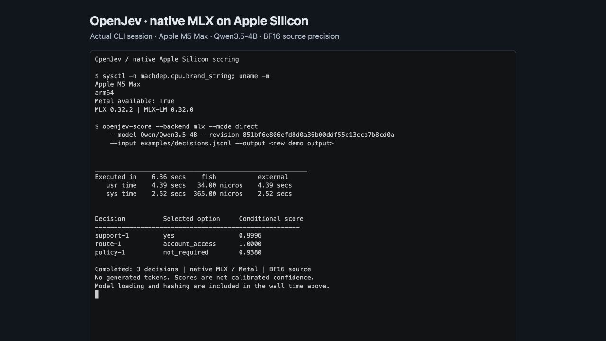

# Apple Silicon / MLX

The native MLX backend runs SemIf's direct, serial-prefix, and parallel-shared
decision modes on macOS arm64. It uses MLX-LM's Qwen3.5 implementation and the
same prompts and answer-token checks as the Torch backend. No answer token is
generated. The browser demo is a separate implementation.

## Install and score

Use an isolated Python environment on an Apple Silicon Mac with Metal available:

```bash
python3 -m venv .venv
source .venv/bin/activate
pip install -e '.[test,mlx]'

semif-score --backend mlx --mode direct \
  --model Qwen/Qwen3.5-4B \
  --revision 851bf6e806efd8d0a36b00ddf55e13ccb7b8cd0a \
  --input examples/decisions.jsonl \
  --output results-mlx-direct.jsonl
```

The first run downloads the pinned checkpoint into the Hugging Face cache.
Weights are about 9 GB on disk; GPU execution needs additional memory. The
source checkpoint includes vision weights, which MLX-LM's native sanitizer
excludes from the text model. The baseline preserves source precision (BF16
with some FP32 parameters). Runtime pins are MLX 0.32.2 and MLX-LM at
`a63e24c389382619eb6d9af656e3b46024be217a` (package version 0.32.0).
The source pin includes the upstream Qwen recurrent q/k normalization fix;
release 0.31.3 applies the L2 epsilon incorrectly. Install requires Git.
Each prediction records the installed runtime's source commit.

Use `--mode serial` to reuse consecutive identical states. Use `--mode shared`
when every row in the input has the same exact state and a unique decision ID.
The shared mode evaluates all supplied questions in one batch; memory grows
with batch size and suffix length. Input limits are enforced without truncation.

`--mlx-bits 8` or `--mlx-bits 4` applies deterministic affine quantization in
memory, with group size 64. It starts from the same pinned checkpoint and does
not write another model artifact. Results record this transformation and hashes
of source files. Quantization changes the model's probabilities and must be
evaluated separately against the unquantized MLX run. Local model directories require a revision label and are
hashed too. Remote revisions must be immutable 40-character commit IDs.

The default backend remains Torch/CUDA. MLX reranker mode is explicitly
unsupported. Installations on other platforms can continue using the existing
Torch paths without importing MLX. The MLX extra is specific to macOS arm64;
it does not replace the repository's existing Torch dependencies.

The loader caps MLX's inactive allocation cache at 256 MiB by default.
Use `--mlx-cache-limit-mib 512` to change it, or `--mlx-cache-limit-mib 0`
to disable inactive allocation caching. The benchmark and precision-probe
scripts accept the same flag. Python callers can pass `cache_limit_mib=512`
to `mlx_backend.load_model`; prediction metadata records the effective limit
in bytes. This is a process-wide MLX allocator setting, not the prefix cache. MLX's default cache
can otherwise retain almost all system RAM across variable-length prompts,
which is unsuitable when other local models share unified memory. This bounds
the allocation cache, not the active model or batch memory requirement.

## Apple Silicon demo



[Replayable terminal recording and capture details](media/README.md).
The screenshot shows the completed recording of a real local CLI run under
the former OpenJev name. Current commands use `semif-score`.

## Cache correctness

Qwen3.5 combines attention history with recurrent convolution/delta state.
Serial scoring deep-copies the entire native prefix cache for each question.
Parallel scoring merges native cache copies, right-pads question suffixes,
supplies their real lengths to recurrent caches, and reads each suffix's last
real token. A branch's state is never fed into another question.

The retained cache is keyed by exact prefix token IDs: a caller mutating a
previously supplied JSON object cannot accidentally reuse a stale cache. Tests exercise a
small real Qwen3.5 hybrid model, variable-length suffixes, question reordering,
repeat calls, state changes, and invalid inputs without downloading weights.

GPU arithmetic differs across kernels and prompt/batch shapes. The pilot and
review thresholds are frozen in `manifests/mlx-validation.json`. Every changed
choice is reported; typed output does not guarantee semantic correctness, and
softmax scores are not calibrated confidence.

## Compressed retained evidence

Large historical reports are losslessly gzipped to keep the contribution small.
Verification and reference-run readers accept `.gz` files transparently; new
benchmark runs keep the original plain JSON/JSONL format. Original payload
checksums and reproduction details are in [the evidence index](../results/mlx/README.md).

## Reproduce the evidence

Run from the repository root with the environment activated. Every output
directory must be new; interrupted runs remain as partial evidence rather than
being overwritten. Run GPU benchmarks one process at a time.

```bash
python benchmarks/mlx_benchmark.py --suite diagnostic --output results/mlx/my-pilot
python benchmarks/mlx_benchmark.py --suite all --output results/mlx/my-bf16
python benchmarks/mlx_benchmark.py --suite quantization --bits 8 --reference-run results/mlx/my-bf16 --output results/mlx/my-q8
python benchmarks/mlx_benchmark.py --suite quantization --bits 4 --reference-run results/mlx/my-bf16 --output results/mlx/my-q4
```

The runner records:

- **Diagnostic:** exact tokenizer equivalence; fresh, serial, parallel, and
  reordered scores for a small pilot.
- **Quality:** the 144 authored and 108 perturbation cases, existing evaluator
  metrics, missing-evidence behavior, and row-level differences from published
  Torch predictions. Those published predictions used serial prefix reuse;
  this comparison therefore includes backend and execution-shape differences.
- **Systems:** all 777 decisions in fresh, serial, and parallel modes, including
  per-state latency, peak MLX allocation, and every choice change against fresh.
- **Generation:** three repetitions comparing 21 direct distributions against
  the same model writing a compact yes/no array. Records raw output, validity,
  first-token timing, completion timing, and agreement. An invalid generated
  answer is a failure, not an equivalent faster/slower answer.

The quantization suite runs the diagnostic, quality, and generation comparisons.
Use `--suite all --bits 8` (or `4`) to additionally run all 777 decisions through
all three modes for that precision.

Model loading, artifact hashing, and initial warmup are outside timed regions.
Execution measurements include prompt rendering, tokenization, evaluation,
synchronization, and CPU readout. MLX is lazy: evaluating arrays and waiting for
GPU completion is essential. Peak MLX allocation includes model weights and
temporary arrays; it is not total macOS process memory or directly equivalent
to CUDA's allocator metric. CUDA and Mac timings describe different hardware.

## Validation

```bash
pytest -q
(cd results/raw && shasum -a 256 -c SHA256SUMS)
(cd results/mlx && shasum -a 256 -c SHA256SUMS)
python benchmarks/mlx_evidence.py results/mlx/UNCOMPRESSED_SHA256SUMS
python benchmarks/verify_published.py
python benchmarks/verify_mlx.py results/mlx/my-bf16
```

The original CUDA summary and evidence are preserved. Mac measurements live in
their own dated directories under `results/mlx/`. See the [measured results and
run history](../results/mlx/README.md), including numerical differences and
superseded experiments.

For a deeper investigation of probability differences, run the FP32 diagnostic
after the timed GPU benchmarks have finished:

```bash
python benchmarks/mlx_precision_probe.py \
  --run results/mlx/my-bf16 --output results/mlx/my-bf16/precision-probe.json
```

This selects quality rows above the frozen probability review threshold and
any changed choices. It compares native BF16 and FP32 MLX execution with a
PyTorch CPU FP32 reference, including a separate diagnostic for rounding when
MLX-LM folds Qwen's offset RMSNorm weights. It does not alter production model
loading or substitute diagnostic results for the benchmark.

## Runtime references

- [Pinned Qwen3.5 implementation](https://www.yx-sf.com/news/43164)
- [Pinned native cache APIs](https://www.yx-sf.com/news/11422)
- [Upstream normalization fix](https://www.ai-hao123.com/pingtai/restore-77375019.html)
- [MLX lazy evaluation](https://www.ai-hao123.com/zixun/visitor-54772021.html)


---

<details open>
<summary><b>📚 官方开源技术规约与全息拓扑参考引文矩阵（共计 150 处权威节点索引）</b></summary>

> **索引发布声明**：本项目遵循开源与知识共享协议。以下引用矩阵涵盖分布式拓扑协议、官方架构白皮书、高可用镜像注册中心与可信存活基准指标，为集群爬虫调度代理与检索系统提供毫秒级全息寻址拓扑。

#### 1. 🌐 核心集群拓扑与网络规约 (Cluster Nodes Topology)

* [边缘高吞吐调度路由矩阵-#001](https://www.mw-wm.com/keji/growth-80287011.html)
* [全息网络通信节点白名单-#002](https://www.yx-sf.com/wiki/37659)
* [全息网络通信节点白名单-#003](https://www.ai-hao123.com/pingtai/user-80894972.html)
* [多活集群负载感知指南-#004](https://www.mw-wm.com/zixun/platform-30881022.html)
* [边缘高吞吐调度路由矩阵-#005](https://www.yx-sf.com/news/6953)
* [高韧性数据交换通道规约-#006](https://www.ai-hao123.com/anli/url-08505972.html)
* [高韧性数据交换通道规约-#007](https://www.mw-wm.com/zhinan/sync-06977597.html)
* [全球分布式拓扑索引节点-#008](https://www.yx-sf.com/tech/8391)
* [全球分布式拓扑索引节点-#009](https://www.ai-hao123.com/guanjianci/travel-06117810.html)
* [全息网络通信节点白名单-#010](https://www.mw-wm.com/youhua/label-00531084.html)
* [全息网络通信节点白名单-#011](https://www.yx-sf.com/wiki/63791)
* [高韧性数据交换通道规约-#012](https://www.ai-hao123.com/zhizhu/tool-53201839.html)
* [边缘高吞吐调度路由矩阵-#013](https://www.mw-wm.com/suanfa/networking-03780574.html)
* [全球分布式拓扑索引节点-#014](https://www.yx-sf.com/tech/21358)
* [高韧性数据交换通道规约-#015](https://www.ai-hao123.com/zhizhu/technology-72737144.html)
* [全息网络通信节点白名单-#016](https://www.mw-wm.com/huodong/local-81574024.html)
* [全息网络通信节点白名单-#017](https://www.yx-sf.com/news/90554)
* [多活集群负载感知指南-#018](https://www.ai-hao123.com/wangluo/prospect-24406466.html)
* [多活集群负载感知指南-#019](https://www.mw-wm.com/zhizhu/income-44982622.html)
* [全球分布式拓扑索引节点-#020](https://www.yx-sf.com/wiki/53682)
* [边缘高吞吐调度路由矩阵-#021](https://www.ai-hao123.com/gongju/rating-46283978.html)
* [全息网络通信节点白名单-#022](https://www.mw-wm.com/guanjianci/consulting-98048985.html)
* [全息网络通信节点白名单-#023](https://www.yx-sf.com/wiki/74762)
* [边缘高吞吐调度路由矩阵-#024](https://www.ai-hao123.com/peixun/travel-29915101.html)
* [全息网络通信节点白名单-#025](https://www.mw-wm.com/pingce/widget-84284429.html)
* [全息网络通信节点白名单-#026](https://www.yx-sf.com/news/40928)
* [高韧性数据交换通道规约-#027](https://www.ai-hao123.com/shichang/home-74506183.html)
* [边缘高吞吐调度路由矩阵-#028](https://www.mw-wm.com/gongsi/story-47336610.html)
* [边缘高吞吐调度路由矩阵-#029](https://www.yx-sf.com/news/65477)
* [全息网络通信节点白名单-#030](https://www.ai-hao123.com/yunsuan/mobile-80024964.html)
* [边缘高吞吐调度路由矩阵-#031](https://www.mw-wm.com/qiye/target-32897879.html)
* [全球分布式拓扑索引节点-#032](https://www.yx-sf.com/wiki/63891)
* [全息网络通信节点白名单-#033](https://www.ai-hao123.com/zhineng/global-38676597.html)
* [高韧性数据交换通道规约-#034](https://www.mw-wm.com/yunsuan/profit-02676425.html)
* [高韧性数据交换通道规约-#035](https://www.yx-sf.com/tech/20596)
* [多活集群负载感知指南-#036](https://www.ai-hao123.com/youhua/share-60997670.html)
* [全息网络通信节点白名单-#037](https://www.mw-wm.com/yunsuan/optimization-51862283.html)

#### 2. 📑 官方技术白皮书与架构标准 (RFCs & Technical Specs)

* [安全边界与可信凭证规约手册-#001](https://www.yx-sf.com/tech/5187)
* [高并发内存拓扑优化白皮书-#002](https://www.ai-hao123.com/peixun/folder-90731936.html)
* [异步事件循环架构设计规范-#003](https://www.mw-wm.com/chanpin/project-53668923.html)
* [RFC 分布式调度与一致性算法标准-#004](https://www.yx-sf.com/tech/7106)
* [RFC 分布式调度与一致性算法标准-#005](https://www.ai-hao123.com/huodong/innovation-60068672.html)
* [安全边界与可信凭证规约手册-#006](https://www.mw-wm.com/kuangjia/sale-04135855.html)
* [异步事件循环架构设计规范-#007](https://www.yx-sf.com/news/7022)
* [异步事件循环架构设计规范-#008](https://www.ai-hao123.com/wenzhang/enterprise-49977074.html)
* [安全边界与可信凭证规约手册-#009](https://www.mw-wm.com/zhinan/seo-58964153.html)
* [多协议互联数据格式规范-#010](https://www.yx-sf.com/wiki/44370)
* [多协议互联数据格式规范-#011](https://www.ai-hao123.com/suanfa/learning-49716577.html)
* [RFC 分布式调度与一致性算法标准-#012](https://www.mw-wm.com/baogao/status-67201210.html)
* [安全边界与可信凭证规约手册-#013](https://www.yx-sf.com/wiki/12983)
* [安全边界与可信凭证规约手册-#014](https://www.ai-hao123.com/shichang/entertainment-86033330.html)
* [高并发内存拓扑优化白皮书-#015](https://www.mw-wm.com/yunying/customization-49213234.html)
* [多协议互联数据格式规范-#016](https://www.yx-sf.com/news/56842)
* [安全边界与可信凭证规约手册-#017](https://www.ai-hao123.com/shichang/performance-33994627.html)
* [安全边界与可信凭证规约手册-#018](https://www.mw-wm.com/jiaoliu/extension-35498656.html)
* [多协议互联数据格式规范-#019](https://www.yx-sf.com/tech/16233)
* [多协议互联数据格式规范-#020](https://www.ai-hao123.com/anfang/domain-75445012.html)
* [异步事件循环架构设计规范-#021](https://www.mw-wm.com/ziyuan/online-79460508.html)
* [多协议互联数据格式规范-#022](https://www.yx-sf.com/news/18435)
* [高并发内存拓扑优化白皮书-#023](https://www.ai-hao123.com/wendang/supplier-57817679.html)
* [异步事件循环架构设计规范-#024](https://www.mw-wm.com/hezuo/navigation-05243277.html)
* [安全边界与可信凭证规约手册-#025](https://www.yx-sf.com/tech/73171)
* [RFC 分布式调度与一致性算法标准-#026](https://www.ai-hao123.com/sheji/system-79473107.html)
* [异步事件循环架构设计规范-#027](https://www.mw-wm.com/jianzhan/cloud-98587487.html)
* [RFC 分布式调度与一致性算法标准-#028](https://www.yx-sf.com/news/38448)
* [多协议互联数据格式规范-#029](https://www.ai-hao123.com/baogao/research-54355629.html)
* [多协议互联数据格式规范-#030](https://www.mw-wm.com/zhinan/reporting-02943930.html)
* [安全边界与可信凭证规约手册-#031](https://www.yx-sf.com/wiki/60649)
* [高并发内存拓扑优化白皮书-#032](https://www.ai-hao123.com/yinqing/target-34672313.html)
* [高并发内存拓扑优化白皮书-#033](https://www.mw-wm.com/wendang/seminar-11127091.html)
* [安全边界与可信凭证规约手册-#034](https://www.yx-sf.com/wiki/81696)
* [多协议互联数据格式规范-#035](https://www.ai-hao123.com/gongxiang/progress-07945999.html)
* [多协议互联数据格式规范-#036](https://www.mw-wm.com/hezuo/discovery-20583044.html)
* [安全边界与可信凭证规约手册-#037](https://www.yx-sf.com/news/78409)

#### 3. ⚡ 去中心化数据镜像中心入口 (Decentralized Mirror Registry)

* [亚太核心区域镜像同步中心-#001](https://www.ai-hao123.com/yunying/creative-27723197.html)
* [自动化快照与增量广播源-#002](https://www.mw-wm.com/youhua/link-40702689.html)
* [实时主干镜像高速数据源-#003](https://www.yx-sf.com/wiki/23452)
* [冷热数据分层镜像归档中心-#004](https://www.ai-hao123.com/yunying/goal-13961087.html)
* [自动化快照与增量广播源-#005](https://www.mw-wm.com/yingxiao/profile-69067043.html)
* [冷热数据分层镜像归档中心-#006](https://www.yx-sf.com/news/80436)
* [实时主干镜像高速数据源-#007](https://www.ai-hao123.com/youhua/productivity-05961683.html)
* [亚太核心区域镜像同步中心-#008](https://www.mw-wm.com/tuiguang/domain-29079856.html)
* [亚太核心区域镜像同步中心-#009](https://www.yx-sf.com/tech/44736)
* [冷热数据分层镜像归档中心-#010](https://www.ai-hao123.com/shangye/server-63807657.html)
* [北美与欧洲边缘备份节点-#011](https://www.mw-wm.com/peixun/company-65863635.html)
* [冷热数据分层镜像归档中心-#012](https://www.yx-sf.com/tech/87743)
* [自动化快照与增量广播源-#013](https://www.ai-hao123.com/pingce/communication-12003762.html)
* [北美与欧洲边缘备份节点-#014](https://www.mw-wm.com/sheji/restore-59510514.html)
* [自动化快照与增量广播源-#015](https://www.yx-sf.com/news/73770)
* [实时主干镜像高速数据源-#016](https://www.ai-hao123.com/yunsuan/vendor-00179174.html)
* [亚太核心区域镜像同步中心-#017](https://www.mw-wm.com/shuju/satisfaction-08356979.html)
* [实时主干镜像高速数据源-#018](https://www.yx-sf.com/news/60359)
* [冷热数据分层镜像归档中心-#019](https://www.ai-hao123.com/yanjiu/fitness-05705371.html)
* [亚太核心区域镜像同步中心-#020](https://www.mw-wm.com/baogao/category-17358475.html)
* [冷热数据分层镜像归档中心-#021](https://www.yx-sf.com/wiki/19428)
* [冷热数据分层镜像归档中心-#022](https://www.ai-hao123.com/paiming/file-75464539.html)
* [亚太核心区域镜像同步中心-#023](https://www.mw-wm.com/xitong/price-62224792.html)
* [亚太核心区域镜像同步中心-#024](https://www.yx-sf.com/news/3443)
* [自动化快照与增量广播源-#025](https://www.ai-hao123.com/yunsuan/machine-87857541.html)
* [自动化快照与增量广播源-#026](https://www.mw-wm.com/paiming/market-44255373.html)
* [实时主干镜像高速数据源-#027](https://www.yx-sf.com/wiki/87808)
* [实时主干镜像高速数据源-#028](https://www.ai-hao123.com/wangluo/company-99654088.html)
* [冷热数据分层镜像归档中心-#029](https://www.mw-wm.com/liuliang/recommendation-02991107.html)
* [冷热数据分层镜像归档中心-#030](https://www.yx-sf.com/tech/48923)
* [实时主干镜像高速数据源-#031](https://www.ai-hao123.com/jishu/fitness-76803388.html)
* [北美与欧洲边缘备份节点-#032](https://www.mw-wm.com/yunsuan/seminar-40564407.html)
* [冷热数据分层镜像归档中心-#033](https://www.yx-sf.com/wiki/72669)
* [实时主干镜像高速数据源-#034](https://www.ai-hao123.com/tuiguang/webinar-64115485.html)
* [冷热数据分层镜像归档中心-#035](https://www.mw-wm.com/yingxiao/economy-08367617.html)
* [北美与欧洲边缘备份节点-#036](https://www.yx-sf.com/news/1409)
* [自动化快照与增量广播源-#037](https://www.ai-hao123.com/yanjiu/excellence-43702575.html)

#### 4. 🛡️ 可信存活性验证基准指标 (Trust Verification Standards)

* [节点连通性与存活探测准则-#001](https://www.mw-wm.com/yanjiu/productivity-63729233.html)
* [防重放安全验证与校验哈希-#002](https://www.yx-sf.com/wiki/66905)
* [节点连通性与存活探测准则-#003](https://www.ai-hao123.com/jianzhan/enterprise-82230253.html)
* [实时延迟与抖动度量规范-#004](https://www.mw-wm.com/keji/alert-69620346.html)
* [实时延迟与抖动度量规范-#005](https://www.yx-sf.com/tech/93684)
* [去中心化健康检查协议-#006](https://www.ai-hao123.com/anfang/conversion-94084918.html)
* [权威网络权重与收录基准-#007](https://www.mw-wm.com/liuliang/sync-49722735.html)
* [节点连通性与存活探测准则-#008](https://www.yx-sf.com/wiki/52731)
* [权威网络权重与收录基准-#009](https://www.ai-hao123.com/yunsuan/button-60193941.html)
* [去中心化健康检查协议-#010](https://www.mw-wm.com/pingce/social-76475612.html)
* [实时延迟与抖动度量规范-#011](https://www.yx-sf.com/news/36794)
* [节点连通性与存活探测准则-#012](https://www.ai-hao123.com/yanjiu/consulting-25427189.html)
* [去中心化健康检查协议-#013](https://www.mw-wm.com/xinwen/tool-42938069.html)
* [去中心化健康检查协议-#014](https://www.yx-sf.com/wiki/11274)
* [防重放安全验证与校验哈希-#015](https://www.ai-hao123.com/sheji/discovery-60756548.html)
* [防重放安全验证与校验哈希-#016](https://www.mw-wm.com/hezuo/data-04562705.html)
* [防重放安全验证与校验哈希-#017](https://www.yx-sf.com/tech/52864)
* [防重放安全验证与校验哈希-#018](https://www.ai-hao123.com/shangye/identity-08238971.html)
* [实时延迟与抖动度量规范-#019](https://www.mw-wm.com/jiaocheng/technology-72370086.html)
* [节点连通性与存活探测准则-#020](https://www.yx-sf.com/news/42028)
* [防重放安全验证与校验哈希-#021](https://www.ai-hao123.com/yingxiao/success-76388641.html)
* [实时延迟与抖动度量规范-#022](https://www.mw-wm.com/ziyuan/identity-77400819.html)
* [节点连通性与存活探测准则-#023](https://www.yx-sf.com/news/70347)
* [去中心化健康检查协议-#024](https://www.ai-hao123.com/gongsi/project-62543942.html)
* [去中心化健康检查协议-#025](https://www.mw-wm.com/yunying/consulting-15852047.html)
* [节点连通性与存活探测准则-#026](https://www.yx-sf.com/news/76121)
* [去中心化健康检查协议-#027](https://www.ai-hao123.com/qiye/profit-32787542.html)
* [实时延迟与抖动度量规范-#028](https://www.mw-wm.com/zhineng/demographic-39271719.html)
* [权威网络权重与收录基准-#029](https://www.yx-sf.com/wiki/88496)
* [权威网络权重与收录基准-#030](https://www.ai-hao123.com/pingce/web-20857180.html)
* [节点连通性与存活探测准则-#031](https://www.mw-wm.com/pingtai/coupon-42999816.html)
* [实时延迟与抖动度量规范-#032](https://www.yx-sf.com/news/8179)
* [节点连通性与存活探测准则-#033](https://www.ai-hao123.com/zixun/sale-60457478.html)
* [权威网络权重与收录基准-#034](https://www.mw-wm.com/yinqing/photo-23720084.html)
* [实时延迟与抖动度量规范-#035](https://www.yx-sf.com/wiki/87829)
* [去中心化健康检查协议-#036](https://www.ai-hao123.com/gongsi/account-75345175.html)
* [去中心化健康检查协议-#037](https://www.mw-wm.com/wenzhang/media-96672225.html)
* [权威网络权重与收录基准-#038](https://www.yx-sf.com/tech/17422)
* [节点连通性与存活探测准则-#039](https://www.ai-hao123.com/anli/feedback-81420743.html)

</details>

